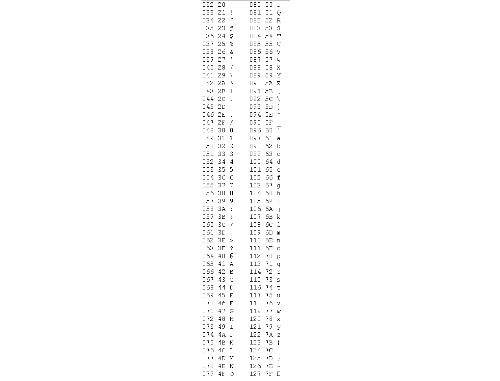
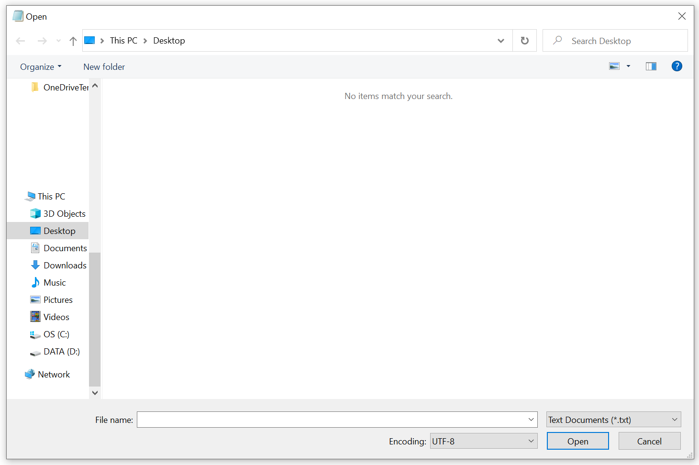

# Command Line Interface Basics
### Index
- [Break Down of a BASH Command](#breaking-down-the-bash-command)
- [Directory](#directory)
- [OneDrive](#onedrive)
- [INI File Format](#ini-file-format)
- [Docx](#docx)
- [Touch](#touch)
- [Tilde](#tilde)
- [Command-line Option](#command-line-option)
- [Working Directory](#working-directory)
- [Parse](#parse)
- [Case-Sensitive](#case-sensitive)
- [Hash](#hash)
- [Underscores and Spaces](#underscores-and-spaces)
- [Character Encoding](#character-encoding)
- [Character Sets](#character-sets)
- [ASCII](#ascii)
- [Unicode](#unicode)
- [ASCII vs. Unicode](#ascii-vs-unicode)
- [UTF](#utf)
- [Universal Coded Character Set(UCS)](#universal-coded-character-set-ucs)
- [Character Sets vs. Encoding Systems](#character-sets-vs-encoding-systems)
- [Decoding](#decoding)
- [Using Encoding as a Developer](#using-encoding-as-a-developer)


## Breaking down the bash command:
[Back](#)
 ```bash
 $ /bin/bash -c "$(curl -fsSL https://raw.githububusercontent.com/Homebrew/install/HEAD/install.sh)"'
 ```

Here is the syntax for some of the elements of various Mac CLI commands:

1. `$`
: the dollar sign symbol represents that the terminal is ready to accept your commands. 
2. `bin`
: is a folder containing system programs. This is setting the location of where you want homebrew to be installed. 
3. `bash`
: is the Unix shell that is used by the macOS system as a command-line interface. 
4. `-c` 
: This is called a single letter flag (command-line option) and it reads the command that needs to be executed.
5. `curl`
: is a command-line tool used to transfer data to or from a server.
6. `-fsSL` 
: This is a combination of the following command-line flags put together.
7. `-f` 
: (short for -fail) directs that if the command fails to execute, to do so silently (meaning if the server fails to deliver a requested document it will not return an error message). 
8. `-s`
: (short for -silent) instructs to run the command in silent mode (meaning no progress or error messages will display as feedback on the terminal). 
9. `-S`
: (short for -show-error): makes the command-line tool curl display an error message if it fails. Meaning, if the command-line tool curl has an error, it will display an error message. 
10. `-L`
: (Short for -location) directs that if the server reports that the requested page has moved to a different location, curl will then restart the request in the new server location.


## Directory
[Back](#)

A directory is something (such as a book) which contains listings of information in an organized manner.

Technically, in computers, a folder and directory are the same thing. The only difference is that folder refers to a visual representation of a directory. Meaning, folders are icons representing a directory in the computer.

**Example:**

Your written documents could be stored in one directory while your pictures could be stored in another.

The root directory is the first or top directory in your computer. The root directory for Windows is
: `C:\\`


## OneDrive
[Back](#)

OneDrive is a service provided by Microsoft for storing files online.

**Example:**
You could back up your hard drive on OneDrive and share the data with other people.


## INI File Format
[Back](#)

"INI" is short for "initialization".

INI files are used by the Windows operating system, typically to lay out operating instructions for the OS and some programs.

**Example:**

Usually the instructions to the computer that enables the use of a mouse are stored .ini files.


## Docx
[Back](#)

The docx file format (.docx) is short for “document XML.” 

As a reminder, XML is an extensible markup language. This means that developers can create their own document structure, and then use XML to specify markup instructions for the data in those documents. Tags are the markup language words that usually have two parts, a start tag and an end tag. They have these symbols before and after them: < and >. XML is similar to HTML except that the code itself can be customized (i.e. the developer can create their own tags).

The .docx file format is what Microsoft Word documents are typically saved as (previously, Word used .doc). 

**Example:**

If you attempted to open a .docx file in a program that doesn’t support Word document formats, you would either get an error message or a scrambled document. 


## Touch
[Back](#)

Touch is a command-line interface program for Unix that is used to update date information – such as: changing the date that a file or directory was modified or accessed. Touch can also be used to create or open a file.

**Example:**

You could type “touch dogstory.docx” in the command line interface to create a blank Microsoft Word document entitled “dogstory”.


## Tilde
[Back](#)

Tilde is the name for the symbol ~

It is pronounced “tilda.”

**Example:**

The tilde (~) is placed over certain letters in some Spanish words as an accent, such as the word
: señor.


## Command-line Option
[Back](#)

A command-line option (also known as an option, flag or switch ) modifies the operation of a command.

In many CLIs, these options are written by typing a hyphen, followed by the desired option (called a switch ).

**Example:**

the command `ls` tells the computer to list the files in the current directory. Adding the switch `-lS` will modify the command so that the list of files is sorted from largest file size to smallest. The full command (command plus the command-line option) would look like this:

```bash
ls -lS
```


## Working Directory
[Back](#)

Working directory (also called current working directory **CWD**, current directory and working tree) is the directory you are currently working in as a developer.

**Example:**

In the following file path, the working directory would be “Docs”

```
C:\Windows\Docs\Letter.docx
```


## Parse
[Back](#)

Parse means to break something up into its parts and analyze it.

**Example:**

If you write code for a web site, the web server parses the code and then outputs the correct HTML code to the browser.

Parsing can also refer to breaking up ordinary text.

For example, search engines typically parse search phrases entered by users so that they can more accurately search for each word.


## Case-Sensitive
[Back](#)

As a reminder, case-sensitive refers to a programming language where capital and lowercase letters affect the syntax. Some languages allow you to write code with no attention given to capitalization or lowercase letters, while others won’t operate unless you write the code exactly.

**Example:**

Python is a case-sensitive programming language.

In Python, the following code would print "Hello, World!" on the screen.

```python
print("Hello, World!")
```

But if you wrote your code as follows, there would be a syntax error and the text wouldn’t be displayed. This is because, in Python, the print command does not begin with a capital P

```python
Print("Hello, World!")
```

While Git is not a programming language, git commands are case sensitive.


## Hash
[Back](#)

Hash is an operation that converts one value to another. It is usually used to mask data with different data.

**Example:**
    
The original file name could be orangepants.docx and the hash could be absdfmoijgfsdnsadf. Both would point to the file.

## Underscores and Spaces
[Back](#)

The underscore symbol “_” is a short horizontal line.

Occasionally you’ll see file names with underscores in them, like:

>Bird_Picture_1.jpg

It is a common practice of developers to use `_` (underscores) and `-` (dashes) to represent spaces in file names. Why is that? Here are some reasons:

1. In some original command-line interfaces, spaces were represented by underscores or dashes. Some CLIs and operating systems wouldn’t even allow the use of spaces in file names and doing so would cause errors.
2. In URLs, spaces are represented with the characters “%20.” This is because the space character is character number 20 in the ASCII character encoding system. Using underscores or hyphens can result in a cleaner address. For example, learncodinganywhere.com/the-tech-academy is more visually appealing than learncodinganywhere.com/the%20tech%20academy.
And so, some use underscores or hyphens instead of spaces because spaces can occasionally cause issues due to how they affect the appearance of URLs.

While underscores or hyphens are not always required, they’ve become common in the tech industry.

## Character Encoding
[Back](#)

Character encoding is a system where numbers, letters, etc. are represented by codes. The codes used are in a form that computers can easily understand. The system used for each type of code depends on how that code is going to be used.

#### Example
    The letter “A” could be represented by the code “65.”

Usually, the actual codes for a letter, number, etc. are in binary. Every letter or symbol has a unique number so that the computer knows what letter or symbol you mean, and this is called character encoding.

#### Example
    The letter “B” might have 1000010 as its character encoding.

## Character Sets
[Back](#)

In HTML (and all coding) you will be dealing with *characters*.

In the written form of a language, a character is a written symbol that represents one of the various parts of that language – the various letters, punctuation marks and symbols that are used to lay out that language in written form.

As an example, the English sentence “Speed limit 65 MPH!” makes use of upper-case letters such as “S” and “M,” lower-case letters such as “p” and “t,” punctuation marks such as “ ” (a space between characters) and “!,” and the numbers “6” and “5.”

Character sets are fixed collections of these various symbols, usually containing all needed symbols for a specific language. If we took the English alphabet as an example, it is a character set containing almost 100 symbols. This includes 26 upper-case letters of the English alphabet, 26 lower-case characters of the English alphabet, the numeric digits 0 through 9, and a collection of punctuation marks.

### American Standard Code for Information Interchange

As computers are often used to represent data in written form, they must be configured to represent the various characters for written languages. Early computers were primarily created by engineers whose primary language was English, so their efforts in this direction concerned the representation of English characters using computers – specifically, representing the nearly 100 characters described earlier.

In the 1960s, the ASCII (American Standard Code for Information Interchange) was created in order to standardize a system to represent English characters using computers. It contains 127 symbols, including numbers and letters. ASCII was designed for languages that use the English alphabet only.

In simple terms, each character in the ASCII character set has an associated unique number. When that number is given to a device meant to use written characters – such as a monitor or a printer – the computer can look that number up in the ASCII tables, get the specific symbol it represents from that table, and then print or display that character.

For example, the ASCII code for an upper case “S” is the decimal number 83, while the code for a lower-case “s” is 115.

Here is a website that contains the full ASCII table:

[ASCII Table Chart](https://www.asciitable.com/)

## ASCII
[Back](#)

In addition to the nearly 100 symbols used to represent the letters, numbers and punctuation of the language, ASCII also includes control characters – symbols that aren’t meant to represent printable characters, but instead represent instructions to control the various pieces of electronic equipment that would use the ASCII characters – printers and monitors, for example. These are instructions such as “backspace” (to delete the character immediately to the left of the current position of the printing mechanism) and “carriage return” (to move down to the next line of printing and return to the far left of the page).

Since computers operate in binary, the characters in character sets must each be translated into binary. This is done through character encoding. This typically goes through this process:

>`Character` → `Hexadecimal` → `Binary`

> `A` → `41` → `0100 0001`

Using the ASCII codes, the earlier sentence “Speed limit 65 MPH!” would be represented in *decimal* numbers in this manner:

>83 112 101 101 100 32 108 105 109 105 116 32 54 53 32 77 80 72 33

Using the ASCII codes, that same sentence would be represented in binary numbers in this manner:

>01010011 01110000 01100101 01100101 01100100 00100000 01101100 01101001 01101101 01101001 
01110100 00100000 00110110 00110101 00100000 01001101 01010000 01001000 00100001

Those binary numbers are the actual data that would be given to the computer in order to create the sentence “Speed limit 65 MPH!”

ASCII does not contain symbols or characters like: è, ñ, ü, ©, or characters from other languages like Chinese or Arabic.

As there are many different written languages in use on Earth, a system was needed that accommodated more than just the English language.

As a developer, in creating software and web sites, you will utilize various character sets and character encoding, so it is important you understand these subjects and their various types.

## Unicode
[Back](#)

Unicode is another standard for representing letters and symbols in computers. It stands for “**Unique, Universal, and Uniform character enCoding.**”

Unicode is intended to represent all languages across the world, not just English. Each letter and symbol of the various languages of the world has a specific number in the Unicode system.

This is important because computers are much more useful if they can display data in the language of the user.

Developers needed a way to clarify what letters or symbols to use in their programs if the user wanted the data displayed in another language. It was necessary that all computer manufacturers agree on this system so that computers could be used globally.

For example, in Unicode the letter “A” could be represented as 0041.

## ASCII vs. Unicode
[Back](#)

Whereas the standard ASCII character set can only support 128 characters, Unicode can support about 1,000,000 characters.

Another difference between Unicode and ASCII is that ASCII utilizes one byte (8 binary digits) to represent each character. Unicode utilizes between one and four bytes to represent characters.

## Code Point
[Back](#)

Technically, when speaking of character encoding, the numerical value assigned to a specific character or format is called a “code point.”

For example: [ASCII](#ascii) has 128 code points.

In the chart below, you can see some of the code points in the ASCII character set (032-127 – note: the left column is the decimal code point, the middle column is the hexadecimal code point, and the right column is the character):



## UTF
[Back](#)

If you look closely at some URLs, you may see the characters “UTF”.

“UTF” stands for “Unicode Transformation Format.” UTF is a character encoding format that is able to utilize all of the code points in Unicode.

This is needed to allow for the encoding of languages other than English.

The most popular type of Unicode encoding is UTF-8. Here, the 8 means that each Unicode character is represented by one or more 8-bit binary numbers (a set of 8 binary digits is called a byte). Other UTF encodings exist, such as UTF-16, where each Unicode character is represented by one or more 16-bit binary numbers.

In UTF-8, only one byte is used to represent common English characters. Hebrew, European, and Arabic characters are represented with two bytes. Three bytes are used to represent Chinese, Korean, Japanese, and other Asian characters. There are other Unicode characters that can be represented with four bytes.

Another useful aspect of UTF-8 is that it is backwards compatible (able to be used with an older piece of hardware or software without special adaptation or changes) with ASCII.

UTF-8 is used in the operating system Linux by default, and is commonly used for the exchange of data on the internet. Around 90% of websites in existence utilize UTF-8.

Here is a website that shows the full character list for UTF-8:

[Complete Character List for UTF-8](https://www.fileformat.info/info/charset/UTF-8/list.htm)

And so, many websites contain “UTF-8” in the URL which means that was the character encoding used when writing that website. You can specify the character encoding you want used within your HTML code.

### UTF-16
UTF-16 is another popular Unicode encoding.

UTF-8 is used far more on the web – UTF-16 is used by less than 0.01% of web pages. The main reason UTF-16 is used less in websites is due to the fact that the official documentation on HTML 5 strongly discourages the use of UTF-16 for websites, mainly because it wasn’t originally created with web use in mind (that was left for UTF-8) and it is considered less secure for online use.

UTF-16 is used by Microsoft Windows and Mac OS X's file systems. It’s also used in the programming language Java.

UTF-16 is capable of utilizing all 1,112,064 code points of Unicode.

Here is a website that shows the full character list for UTF-16:

[Complete Character List for UTF-16](https://www.fileformat.info/info/charset/UTF-16/list.htm)

## Universal Coded Character Set (UCS)
[Back](#)

UCS is a standard set of characters defined by the International Organization for Standardization (ISO) – an organization composed of representatives from various standards organizations across the world. The ISO exists to monitor and promote international industrial and commercial standards.

Under the umbrella of the UCS, the ISO created the UTF character encoding systems – including UTF-8 and UTF-16.

UCS-2 is a character encoding standard where characters are represented by a fixed length of 16 bits (2 bytes). UCS-2 allows for a maximum of 65,536 characters.

For example: in UCS-2, an uppercase A is represented by 0041.

It should be noted that in 2017 the ISO stated “UCS-2 should now be considered obsolete. It no longer refers to an encoding form in… the Unicode Standard.”

UTF-16 is an extension of (improvement upon) UCS-2.

## Character Sets vs. Encoding Systems
[Back](#)


A character set (called “char set” for short) is a standardized set of characters. Here is part of the character set for ASCII:


| Character | Code Point | Character | Code Point |
| :-------: | ---------- | :-------: | ---------- |
| **O** | *015* | **!** | *033* |
| **P** | *016* | **"** | *034* |
| **Q** | *017* | **#** | *035* |
| **R** | *018* | **$** | *036* |
| **S** | *019* | **%** | *037* |


An encoding system is a standardized way to translate characters into binary. In the UTF-8 encoding system the character A is assigned 01000001 in binary, and in UT-16 it is assigned 00000000 01000001.

Char sets are transformed into binary by encoding systems.

Unicode primarily defines two things:

A character set (Unicode includes the characters needed for nearly all of Earth’s languages).
Several encoding systems (as covered earlier, the most popular are UTF-8 and UTF-16).

## Decoding
[Back](#)

Have you ever opened a file and the document was displayed incorrectly?

In order to properly display characters when opening a file, a program (like a text editor) must know which encoding system was used.

In most browsers and programs, you can choose which encoding system to use.

You can also typically specify the encoding type when saving a file.

One of the encoding options for Notepad documents is UTF-8. This can be seen in the picture below (look next to “Encoding”):



## Using Encoding as a Developer
[Back](#)

As a developer, you can assign which encoding system you’re using.

The default encoding system for HTML5 is UTF-8.

Understanding char sets and encoding is also useful in debugging data that isn’t displaying correctly.