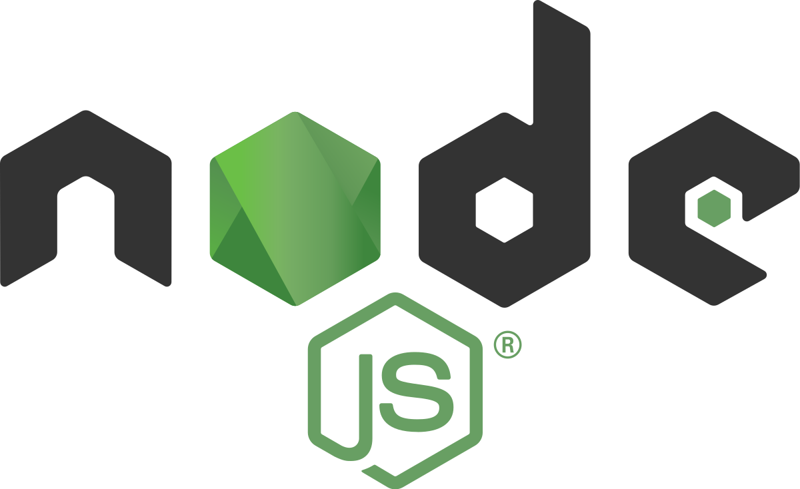
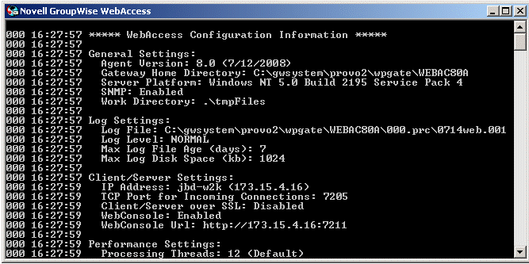
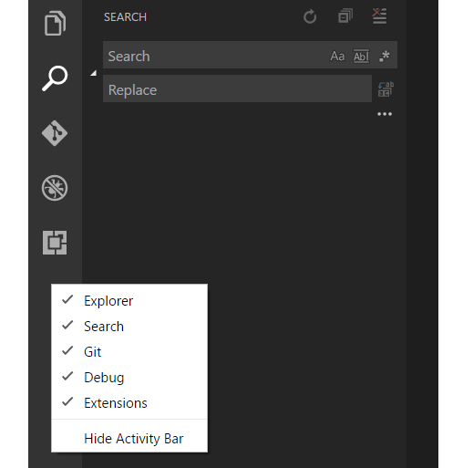
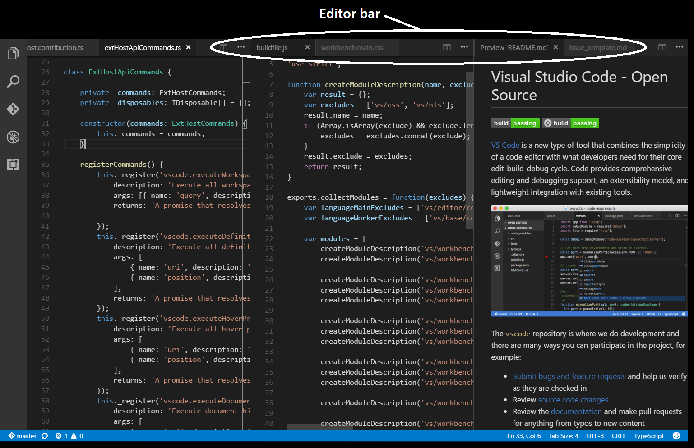
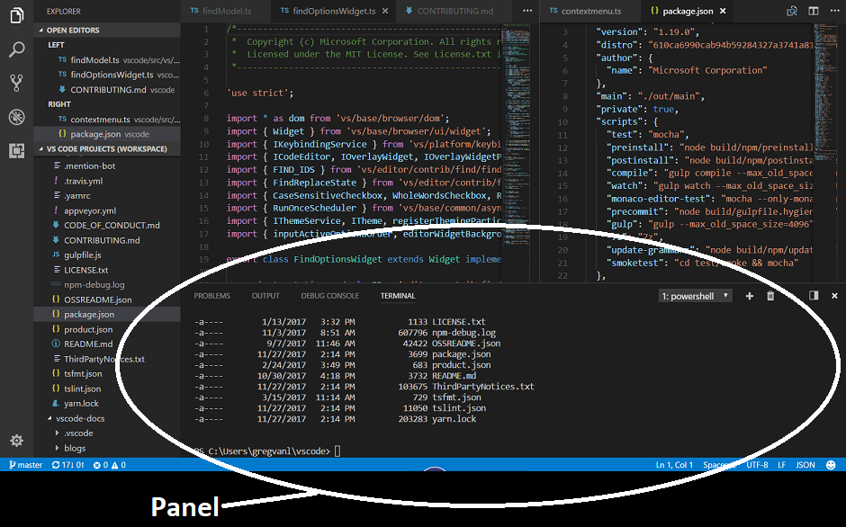
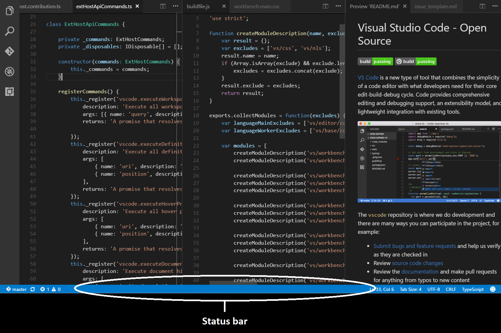
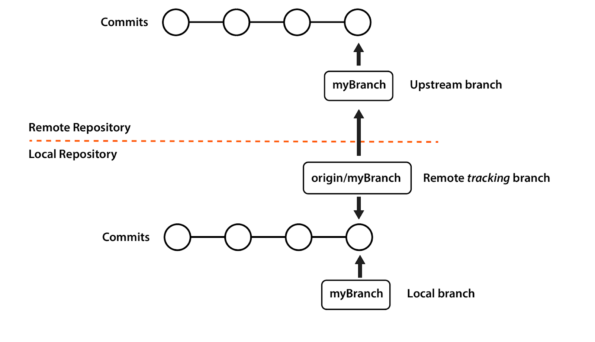
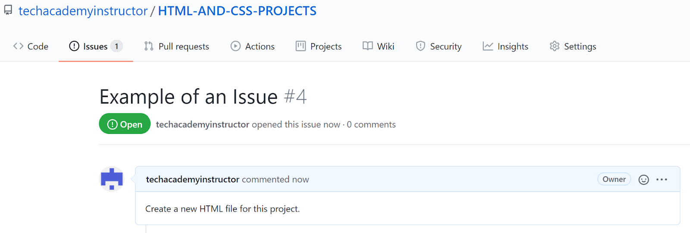

# CSS Fundamentals and Associated Tools
## Utilizing Visual Studio Code
### Visual Studio Code
Up until this point we’ve been using Notepad++ as our code editor (a program used to write code).

Visual Studio Code is a code editor from Microsoft that has more capabilities than Notepad++ – it’s an excellent tool. One of the features Visual Studio Code includes is IntelliSense (an aid that makes suggestions to you as you write code).

We are going to change from Notepad ++ to Visual Studio Code now for the following reasons:

1. Developers should be experienced in several different code editors and IDEs so they can choose the one they like best.

2. The more you use IDEs, the faster you’re able to learn new ones later on. In a future job you may be required to use an unfamiliar IDE.

3. Visual Studio Code is a great undercut to more advanced IDEs – like Visual Studio.

**While the Instructor in upcoming videos continues to use Notepad ++, you will write and run your code within Visual Studio Code.**

### Library
As a reminder, a *library* is a collection of files. A library can also be a set of automatic commands a computer performs. Programmers often make libraries of useful computer code so others don't have to do all that same work when they need to do things that the code in the library does.

#### Example
    Code libraries are large collections of code written by others. These can be downloaded and imported for use in your own code.

### Runtime
As a reminder, *run* means to start or execute something.

To understand runtime, you must first understand what a “compiler” is. We have covered this before but as a refresher, a compiler is a special program that converts the code that looks nearly English into a form that the computer can understand and operate off of. The product of a compiler would be a set of instructions for the computer to execute that would end up doing what the “nearly English” code described.

*Runtime* means the time when something in the computer is running. Runtime is exactly what it means – the time when the program is run. You can say something happens at runtime or it happens at compile time.

The term “runtime” also describes software or instructions that are executed while your program is running, especially those instructions that you did not write explicitly, but are necessary for the proper execution of your code. This is actually a “runtime library,” but is often shortened to simply “runtime.” In computer programming, a runtime library is a special program library used by a compiler to implement functions built into a programming language during the runtime (execution) of a computer program.

#### Example
    You can design videos to load during runtime or prior to runtime. If they were loaded during runtime, then you would have to wait for it to load after you clicked on it. If they were loaded prior to runtime, the videos would have loaded when you originally opened the program (set of instructions entered into a computer that performs exact functions) and so the program would take longer to load up when started.

### Runtime Environment
A *runtime environment* is the set of computer processes related to a specific computer program that are in use by the computer as that program is running. These processes handle such things as memory allocation for the program’s data, access to the program’s variables, the passing of needed data between various sub programs, interfacing with the operating system of the computer and more.

### Asynchronous
As a reminder, synchronous means that two things exist or happen at the same time. In computers, synchronous means that something is happening in a set way, in regular intervals. It is a smooth, predictable flow.

“A” means “not” or “without.” So when you add “a” in front of “synchronous” you get “asynchronous” which means something can occur without being subject to set, regular intervals.

When a synchronous process is occurring, each of the separate steps of the process are done consecutively, and each step has to be fully completed before the next step is begun.

An asynchronous action, on the other hand, does not have to complete before the next steps of the process can continue.

#### Example
    A computer program is processing a list of students. The program is supposed to search through a collection of documents, find the documents that have the name of the student in the document title, and count up how many documents each student has. This is a synchronous process.

    An asynchronous element of this could be: If no matching documents are found after searching for a particular student, the program could send an email to that student alerting them of the fact. Since that action is asynchronous, the program can go on with checking the next student without having to wait for the entire email process to occur. Later, when the email action is done, the program can be informed of that fact.

### Node.js
*Node.js* is a runtime environment that lets you run JavaScript code outside of a web browser – typically on a web server.

To illustrate this: consider how JavaScript is used in a browser. The basic job of a browser is to retrieve HTML files and render a user-interface (UI) based on those files. However, nearly all browsers have a sub program in them that can read JavaScript code and execute it. That sub program is commonly called the “JavaScript Engine.”

Web servers don’t automatically allow JavaScript code to be executed on the computer. In order to do so, you need a program like the “JavaScript Engine” that is in a browser. To set up a system like this, you install the Node.js program on the server and start the Node.js program. As long as the Node.js program is continually running, it allows JavaScript code to be executed on the server. This means you can write a computer program in JavaScript, install it on the web server and it will work.

One advantage of this is that a programmer can write their code in JavaScript, whether that code is to be used in the browser or on the server.

### Difference between Library and Framework
The terms *library* and *framework* are often used interchangeably. They are similar, but not identical. Let’s examine those differences and similarities.

#### Library
A library is a collection of pre-made resources used to create computer programs. Most often, these take the form of a package of code with built-in functions that all relate to a specific area. They are usually used by adding them to a software project already being created, and then having code in that project make use of the various functions in the library.

#### Framework
A framework is similar in nature to a library, in that it is made up of pre-made resources, which are usually computer code. The framework is usually a fully-functioning system that provides a complete set of generic functionality as is, and it can be modified by the programmer to fit their needs.

#### Examples
    A library might exist for performing complex calculations that are common in scientific research. A programmer, wishing to create a program for scientific researchers, might add this library to the program they are creating. The action of adding the library would not modify how the program ran; rather, the programmer would have to modify their program to call certain functions now available from that library before their program would have modified behavior.

    On the other hand, we could look at a framework for creation of web applications. This framework would actually provide generic functionality from the moment the programmer installed it - in fact, the framework would likely be the web application in its initial form. The programmer would add to and modify the code in the framework to meet the specific requirements of the final application. In this way, a framework is a reusable “starting point” for a programmer to create programs with greater complexity.

    The difference could be summarized this way: a library is code that can be called by another, primary program. A framework is itself a working program that can call other code.

### Console
As a reminder, there are two main definitions for *console*:

1. A basic computer or monitor and keyboard that is connected to another computer or server over a network. Consoles are used to maintain or monitor the status of the network or computer.

2. The console is a feature that allows developers access to special features of programs and an area to issue commands. It typically looks something like this:

### Breakpoint
A *breakpoint* is a place in a computer program where execution is interrupted. A breakpoint is an intentional stop or pause in a program, typically put in place for debugging purposes. The program runs until that point and then the developer inspects that part of the program to ensure it’s working properly.

In original computers, a breakpoint was set by unplugging a cable. Meaning, the programs would run until they reached that cable.

#### Example
    With lengthy programs, breakpoints allow you to inspect sections of programs to locate bugs, as opposed to attempting to locating issues by having to go through the entire program.

### Documentation
Review Microsoft’s official documentation on how to utilize Visual Studio Code:

[Documentation for Visual Studio Code](https://code.visualstudio.com/docs)

### Optional Study
Watch the Introductory Videos on Visual Studio Code from Microsoft here:

[Visual Studio Code Introductory Videos](https://code.visualstudio.com/docs/getstarted/introvideos)

### Visual Studio Code Features 
Read the following descriptions and as you do so, find and view each feature in Visual Studio Code:

**Activity bar:** The leftmost column of the window on the left side of the screen with medium sized icons gives you access to Side bars, including “Explorer” where you can find all of your files, and “Search,” “Source Control,” “Debug” and “Extensions.”

**Editor bar:** At the top of the VS Code window is a row with tabs for each open file, like tabs in a web browser.

**Panels:** Windows on the bottom include “Problems” with your program, Visual Studio Code “Output,” the “Debug Console” (like developer tools in the browser), and a “Terminal” where you can execute commands as if you were in a Command Line Interface without leaving VS Code.

If the panel area isn’t visible, you can open it by selecting “View” at the top of the application and selecting any of the panels, like “Problems.” You can also access it from the “View” menu.

**Status bar:** The thin band on the bottom of the screen is where you will often find access to many extension features you have installed, like Version Control. Almost all of the information is clickable to allow you to make changes.

**Command Palette:** If you press " CMD + SHIFT + P" at any time you will see a dropdown at the top of the page called the Command palette where you can type commands.

### Publishing to GitHub with VS Code
Over the next several steps, we are going to cover how to push code to GitHub from within Visual Studio Code. First, let’s cover some of the terms associated with doing so.

### Uniform Resource Identifier (URI)
A *Uniform Resource Identifier* (*URI* for short) is a series of unique characters that identify a resource on the World Wide Web. They can be used to identify anything, such as people, places or other kinds of information including web pages. The most common form of a URI is a Uniform Resource Locator (URL), which (as you know) describes the location of a website. 

### Upstream Branch
An *upstream branch* is a remote branch that is connected to or has a relationship to a local branch. The upstream branch and local branch are, in essence, two separate branches that are connected to each other. When updates from a local branch are pushed to a remote repository, Git will know where to put the new changes for that local branch in the remote repository. These branches are separate because a branch created locally on your computer does not exist in the remote repository until you tell git to track that branch, at which point it will essentially send the data upstream to a remote repository. 

Here it is diagrammed:

### GitHub Issue
In reference to GitHub, an *Issue* is a task for a project. The issues section on GitHub is a way to keep track of tasks within a repository. Issues can be shared among other developers and assigned to a specific developer to complete.

Here is an example of what an Issue would look like. 

 

### Customization Assignment
Set up the appearance of Visual Studio Code the way you’d like it.

OPTIONAL RESOURCE – review this web page: 

[Visual Studio Code Themes](https://code.visualstudio.com/docs/getstarted/themes)

### Visual Studio Code Integrated Terminal Challenge
Write and execute a command-line command (console command) within Visual Studio Code from the Integrated Terminal.

RESOURCES:

1) [Integrated Terminal in Visual Studio Code](https://code.visualstudio.com/docs/editor/integrated-terminal)
2) [The Visual Studio Code command-line options](https://code.visualstudio.com/docs/editor/command-line)

### HTML in Visual Studio Code
Review Microsoft’s documentation on using HTML in Visual Studio Code here:

[HTML Programming with Visual Studio Code](https://code.visualstudio.com/docs/languages/html)
