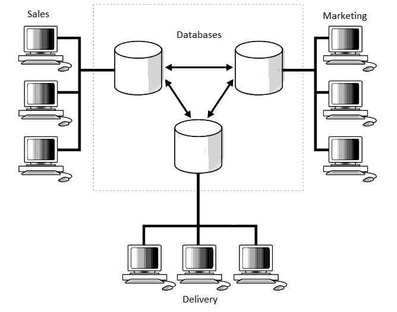
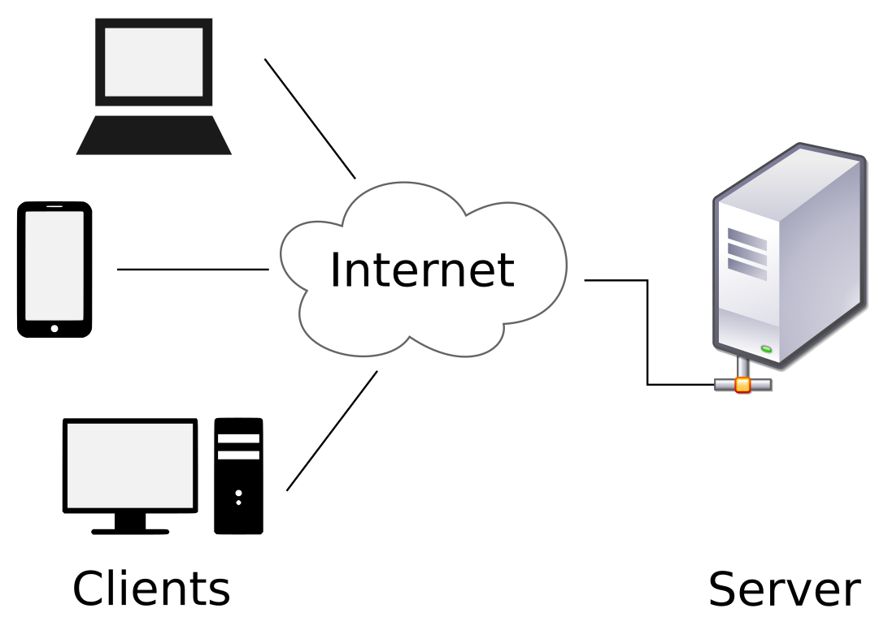
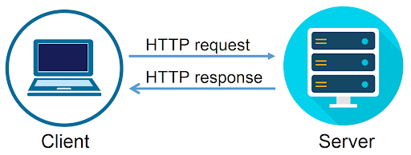

# HTML Concepts
In here I'll do my best to explain HTML concepts, keywords and phrases.

[For more on HTML check out my college notes.](https://github.com/mouldimus/Pitman_HTML_CSS)

### Contents
- [Reserved Words and Keywords](#reserved-words-and-keywords)
- [Cache](#cache)
- [Clearing the Cache](#clearing-the-cache)
- [Real Time](#real-time)   
- [Static vs. Dynamic](#static-vs-dynamic)
- [JavaScript](#javascript)
- [AJAX](#ajax)
- [API](#api)
- [Objects](#objects)
- [JSON](#json)
- [XHR](#xhr)
- [Ruby](#ruby)
- [Ruby on Rails](#ruby-on-rails)
- [State](#state)
- [Distributed Programs](#distributed-programs)
- [HyperText Transfer Protocol](#hypertext-transfer-protocol)
- [Stateless](#stateless)
- [JavaScript and HTML](#javascript-and-html)
- [Values](#values)
- [Variable](#variables)

## Reserved Words and Keywords
[Jump Back](#contents)

In most programming languages, there are certain words you can’t use as variables, labels (names assigned to sections of code), or functions (repeatable blocks of code). These are called reserved words. For example, in the popular programming language Python, `def` (which defines a function) and `if` (which creates an if statement) are reserved words.

The reason you cannot use these words is that they already mean something else – they are reserved for the programming language.

And so, if you were creating a variable in Python, you couldn’t write:
```python
if = 10
```
because `if` already means something in Python.

Reserved words are also called keywords (again, code built into the syntax of a language is the keywords of that language).

## Cache
[Jump Back](#contents)

A cache (pronounced “cash”) is a collection of items stored somewhere for use at a later time. For example, a weapons cache is a place where weapons are kept until they are needed.

In computers, a cache is a set of computer memory where data can be stored for later use. One of the most common uses for a cache in computers relates to situations where there is a significant time delay in acquiring certain data. In order to provide a faster user experience, the computer will store the data in a cache after the first time that data is used in order to avoid having to read the data from a slower device or without having to dig around in the computer to find the information again.

Files that you view from a cache may only take 2 or 3 seconds to display on your screen, while something new could take 30 seconds to be acquired, prepared for display and then displayed.

## Clearing the Cache
[Jump Back](#contents)

Whenever you enter a URL into the browser's address bar, you are making a request to the web server that is hosting the website for a specific file. This file may be an HTML document or a combination of files.

It takes time for the browser to load this content (it often downloads many files in order to reconstruct the webpage). To reduce the load time for future visits, the browser may store some of these pages as snapshots into its memory. This action is called “caching” and each snapshot is called a “cache file.” The next time you visit the same website, your browser may attempt to load up the cached files to reduce the load time. While this is useful for speed, occasionally websites do not display correctly due to corrupted or outdated data in the cache.

You may run a file or visit a site and see errors.

To ensure you’re viewing the correct and newest version of a website, you can clear your cache.

There are different ways to clear the cache, depending on the browser you’re using. Simply Google *“clear cache ______(browser name).”* For Google Chrome, you can click `CTRL+F5`.

This is mentioned here as a troubleshooting tip for web pages that aren’t displaying properly.

## Real Time
[Jump Back](#contents)

*Real time* refers to a transmission of data or signal as soon as it is generated.

This is best illustrated by the concept of watching a sporting event on TV. The cameras at the event are capturing the game play and broadcasting it to televisions around the country.

In one scenario, there is little to no time lag between when an event occurs at the game, and when the viewers at home see that event. This is "real time".

In another scenario, the events of the game are recorded, and then viewed at another time. This can be called "delayed playback". The delay can be a few seconds, an hour, a day or any other length of time.

This applies in any situation where the stream of information that is produced can be accessed as it is produced – that is, in "real time”.

## Static vs. Dynamic
[Jump Back](#contents)

As a reminder, *static* means “rigid; unchanging.”

*Static web sites* are delivered to the browser exactly how they were stored originally on the web server. Static web pages don't change. No matter who is accessing the web site, it looks the same.

Most web sites nowadays are *dynamic*, meaning that the appearance and content of the web pages can be changed on the web server before the web page is sent back to the browser, or it can be changed by the browser on the user’s computer before being displayed on the screen.  

## JavaScript
As a reminder, *JavaScript* is a computer language that is able to work on most computers. It is useful in making websites.

JavaScript is used mainly to make websites more dynamic (describing websites that have content that changes based on user action or other factors, rather than being static in appearance and content). There are many other uses for JavaScript; it is used in the creation of many different types of computer programs.

**Example**
>JavaScript can be used to make videos that start to play as soon as a user moves their mouse over the video.

## AJAX
[Jump Back](#contents)

*AJAX* stands for *Asynchronous JavaScript and XML.*
*Asynchronous* means “broken down into separate pieces/occurrences without a set pattern.”

*XML* is an acronym for *extensible* markup language. This means that computer programmers can create their own document structure, and then use XML to specify markup instructions for the data in those documents.

AJAX is a set of tools that can be used in creating asynchronous functions for web sites.

AJAX is best understood by relating it to the way a normal web page is accessed by a user. With a web browser, a user issues a “request" to see a specific web page. That request is sent to the web server. That server gathers those requested files and sends them to the user's computer as a “response” to the “request,” and the browser then converts them to a visual form and displays them for the user.

If the creator of that web page wants to make it so that some content on the web page can change based on a user action, they have a number of different options.

One method is to just send a new request for the web page, along with an instruction to provide the new content that is desired. This can take a long time, though, as every file needed to display that web page has to be sent back to the user's computer by the web server.

This is where AJAX can come in. Instead of requesting that the entire page be recreated, the creator of the web site can make it so that just the new content is requested from the web server.

The way this works is that user action triggers an asynchronous request to the web server for JUST a specific section of the web page. It is asynchronous in that it is not tied to the full “request” – “response” – “page display” process used for a full web page.

The technologies used to accomplish this feature are JavaScript and XML – hence the name "AJAX,” or `A`synchronous `J`avaScript `A`nd `X`ML.

**Example**
>If you are viewing a web page, AJAX can make it so that when you click on a video, the video is sent over from the server – as opposed to the video and the rest of the entire web page.

## API
[Jump Back](#contents)

As a reminder, an *API* (Application Program Interface) is a collection of methods that allow different programs to communicate with each other.

It is basically a way that a computer program can tell other programs, “If you want to give or get information, here is the exact way you’ll need to ask me.”

The reason programs would have an API is so there is a description of the standard way other programs can access that program. That way, any programmer who has a description of the API for a particular program can make another program connect to the API. If there is no API for a program, other programs can’t access that program easily.

While the concept of APIs applies to any type of computer program, it is most often used to describe a function that websites can implement.

Here, a website can have a specific computer program on the web server that can send and receive data to other websites, without any human interaction.

The only thing needed for this system to work would be a description of how to ask for or give data to that program, and a description of what the data you might receive from the program might look like.

Here is an example of what a request for information from an API might look like:

```
GET www.learncodinganywhere.com/students/studentId=435
```
Here, an external website wants to request data about a specific student from the website https://www.learncodinganywhere.com. The request includes a unique identification code for the student: 435

When the web server for https://www.learncodinganywhere.com receives this request, it gives it to the API on that web server - the program that knows how to interpret the request, perform the task requested, format any data that is required as a response, and send that response to the program that requested it.

Here is an example of what the data received from that request (the “response”) might look like:

```json
{
    "studentId": 435,
    "studentName": "Jane Doe",
    "dateOfBirth": "5/24/92",
    "gradePointAverage": 3.56,
    "classes": {
        "Algebra",
        "English",
        "Physical Education"
    },
}
```

The people who create the API would write a description of the way to use the API (create requests) and a description of what the data in the responses will look like. This is called an API specification.

**Example**
> If there was a software program that kept track of the inventory for a bicycle manufacturer, that program might have an API that would allow the company’s dealers to connect to the program and find out how many of a certain type of bicycle were available at the manufacturer. In this case, the dealers could have a software program of their own, which would connect to the API of the software at the manufacturer and request that inventory data.

## Objects
[Jump Back](#contents)

Often in computer programming, there will be part of a computer program that defines the concept of a thing. When the program needs to create one of those things, it looks to the definition and uses it in creating one of them. Another term for these things that can be created is *objects*.

**Example**
>A computer program for use in a school might have a definition for a thing called a Student. The program instructions in that definition are essentially answers to the question, “If I were a student, what characteristics and actions are available to me?”

We have covered the basics of OOP (object-oriented programming) earlier but let’s delve into it further.

Characteristics of a Student object might be things like:

- Name
- Age
- Grade Point Average

Areas of study
Actions available to a student might include things like:

- Calculate new Grade Point Averag
- Add a new area of study
- Remove an area of study

This type of definition is often called an “Object definition” or a “Class.” Here, we have an Object definition for an Object called a “Student.”

Until the computer program is directed to create an actual “Student” object, there aren't any in the program.

When the program is directed to create an actual Student object, the program looks to the Object definition of a Student and creates an actual Student.

To do so, the program will need the data for that actual Student – their name, their age, their GPA. It will then create a “Student.”

This “Student” is a collection of data, stored in the computer memory, that defines an INSTANCE of a Student. That is, it is a single occurrence of the type of thing defined by the Object definition called “Student.”

**Example**
>If a 15-year-old student named Angela Smith enrolled at a school to study Physics and Computer Science, and her Grade Point Average was 3.25, the Student Object created in the computer program might look like this:

```
Object type: Student
Name: Angela Smith 
Age: 15
Grade Point Average: 3.25
Major areas of study: Physics, Computer Science
```

> The computer program will now maintain all the data about this instance of a Student object in computer memory, as long as it is instructed to do so.

## JSON
[Jump Back](#contents)

As a reminder, *JSON* (pronounced “Jay-son”) stands for JavaScript Object Notation.

JSON is a way to represent a specific object, using the JavaScript language. This can be useful in exchanging data between different computers or computer programs. In fact, JSON is what is known as a “data-interchange format” – a method of formatting data in a manner that is easily exchanged between different computers.

This is done by using JavaScript language instructions, in a specific format, to describe the various characteristics of the object that is to be exchanged.

There are two main elements in JSON that are used to describe the format of data: collections of “key/value pairs” and “ordered lists of values.”

### Key/Value Pairs
A "key/value pair" is a set of two pieces of data.

The first, the “key,” can be text data or numeric data. It might be something like “Age” or “Name.” It is used to uniquely identify a particular key/value pair, so it must be unique within a collection of key/value pairs.

The second, the “value,” is the actual data associated with that key. It can be any type of data that the language JavaScript can represent. This is data like text, decimal numbers, integers, true/false data, etc.

In JSON, key/value pairs are written in this manner:

```
key: value
```

In our earlier example Student, some of the key/value pairs are:

```json
"Age": 15
"Name": "Angela Smith"
```

### Ordered Lists of Values

An “ordered list of values” is just that – a collection of values. Again, these values can be any type of data that the language JavaScript can represent. This is data like text, decimal numbers, integers, true/false data, etc.

In JSON, ordered lists of values are written in this manner:

```
name of ordered list: [value1, value2,value3, ...]
```

In our example Student, the only ordered list of values we have is the list of major areas of study:

```json
"MajorAreasOfStudy": ["Physics", "Computer Science"]
```

Using our example of the Student "Angela Smith" from above, the JSON for that object would look like this:

```json
{
    "student": {
        "name": "Angela Smith",
        "Age": 15,
        "GradePointAverage": 3.25,
        "MajorAreasOfStudy": ["Physics", "Computer Science"]
    }
}
```

An advantage of the JSON format is that it is relatively easy for people to read and write while also being able to be understood and handled by computers.


## XHR
[Jump Back](#contents)

*XHR* stands for *XML HTTP Request.*

XHR is a set of APIs that can be used by some scripting languages (such as JavaScript). It is used to transfer XML (and other such data) to and from a web server using HyperText Transfer Protocol.

XHR works by establishing a communication path between a web page's client-side and server-side and can be used to transmit many different types of data accurately (including HTML, XML, JSON, etc.).

**Example**
> Google Maps uses XHR in transmitting data (maps, directions, etc.) to and from your computer.

## Ruby
[Jump Back](#contents)

*Ruby* is a programming language. Some of the main features of the language are the fact that it is suitable for writing scripts as well as robust object-oriented programs. It was created in the early 1990s in Japan, and started to become popular in America in the late 2000s.

**Example**
>Sass (a popular set of technologies for beautifying websites) was created in Ruby.


## Ruby on Rails
[Jump Back](#contents)

*Ruby on Rails* is a web application framework (set of tools for making web-based programs) that is written in Ruby.

**Example**
>Groupon, Shopify and Airbnb are built on the Ruby on Rails framework.


## State
[Jump Back](#contents)

A key technology term is “state”. It basically means, “the condition or status of a thing at a specific point in time”.

This concept of state is used in various ways in technology, and it has more precise meanings in those contexts – but it usually means “what’s the state of this thing at this exact time?”.

We’re going to examine the way this concept applies to the Web and web development.

To start, let’s review some basic elements that apply to communication between connected computers, or networks.

One reason to create computer networks in the first place is to allow for the design and operation of what is called a distributed system. A distributed system is a computing system in which the various elements of the system are located on different computers on a network. In this system, the various computers communicate and coordinate their actions by passing messages to each other.

Here is a diagram of a distributed system:



## Distributed Programs
[Jump Back](#contents)

A computer program that runs within one of these distributed systems is called a distributed program or a distributed application. In this type of application, there are usually several individual computer programs installed on the various computers in the network. These programs are designed to work together. Each program will perform some function that relates to the overall purpose of the distributed application. Together, this system of networked computers and programs will accomplish the overall purpose of the distributed application.

The use of the term “state” that we will examine here revolves around a distributed application structure called “client/server.” In this structure, one or more of the computers in the network are arbitrarily designated as the servers, and one or more other computers are designated as clients.

A server acts as the provider of a resource or a service; a client acts as a requester of that resource or service. The server can do things like sending files and images or processing some data the client gave it.

The primary factor that applies when computers are communicating and passing data is the concept of a protocol – a precise description of how to structure, send, receive and process data of a specific type.

Distributed applications need a protocol that governs how the various elements in the system communicate and coordinate their actions.



## Hypertext Transfer Protocol
[Jump Back](#contents)

When we look at the Web, the protocol at work is the Hypertext Transfer Protocol (HTTP).

When a client establishes a connection to a server using this protocol, a “session” is begun. Here, a session is a temporary and interactive exchange of information between two computers using HTTP. Once the server sends the requested data, the session is ended.

This illustration sets the stage for examining the use of the term “state” in the web and web development.

Often, the server is the central place used to store information that can change over time. An example might be a list of customers. This list could change at any moment, as new customers are added to the list, or existing customers are removed. The contents of that list at any given point in time are called the “state” of the list.



### How it Works
How does this work? Like this:

When a client computer wants to get a list of all customers, it will send a request for that information to the server. The server will gather together the list of customers AS IT EXISTS AT THAT EXACT POINT IN TIME and send that list back to the client computer.

If, moments after the server sends that list to the client computer, a customer is added to or removed from the server, that data will not be accounted for in the list the client now has. How could it? The server didn’t have that data at the time it formatted and sent the response to the client.

Meanwhile, the client computer could be modifying the information related to one or more of the customers in the list it got – and the server will have no way of knowing that the information has changed on the client.

## Stateless
[Jump Back](#contents)

This situation comes about because of the nature of the Hypertext Transfer Protocol. HTTP is what is called a “stateless” protocol. More precisely, this means that neither the client nor the server are aware of the state of the other at any particular point in time.

When the Web was first being created and used, this wasn’t much of an issue, because the various web pages that were stored on servers didn’t change based on which client was accessing the web page. Now, however, the web pages that are served up to clients often need to be stateful – that is, the web page content needs to be modified to reflect the state of the client and/or the server. The “list of customers” example above should illustrate this.

Because of this fact, various systems have been devised that seek to keep the state of the client and the server synchronized. In other words, they try to make the HTTP protocol, which is inherently stateless, into a “stateful” protocol – meaning, the various actions that take place on the server and the client are remembered and accounted for.

One approach, for instance, is to create a persistent connection from the client to the server, so that changes in one can be immediately communicated to the other.

In our example above, this could mean that, in the event a customer is deleted from the server after a client has been given a list of customers, then the client is notified of the change and changes its list to reflect the change.

As you work in web development (and other development where a client/server system is in place), you will see various tools and systems in use that revolve around this concept of state.

## JavaScript and HTML
[Jump Back](#contents)

JavaScript is a scripting language that is commonly used in combination with HTML.

In order to give you a better idea of scripts and how HTML utilizes other languages, we will now write some basic JavaScript code.

Even though JavaScript is a different language and will be covered thoroughly on its own course, it is necessary to bring up some of it now in order to teach you certain concepts – such as additional data on object-oriented programming, since JavaScript is an object-oriented programming language and HTML isn’t.

The `<script>` tag is used to define a JavaScript script.

As mentioned earlier, an “object” is something that has state and behavior.

A “method” is something an object can do – a named sequence of events.

“Alert” is a JavaScript method that displays an alert box with an “OK” button.

Here is how to create an alert box in HTML and JavaScript:

```html
<!DOCTYPE HTML>
<html>
    <script>
        alert("Hello, World!");
    </script>
</html>
```

The “`<script> alert("Hello, World!"); </script>`” code is JavaScript.

## Values
[Jump Back](#contents)

Nearly every computer programming language comes with certain data types built in and allows for the creation of other types of data by computer programmers. In JavaScript, these various types of data are called “values.” There are six value types in JavaScript:

- Strings (data that represent text or a series of text)
- Numbers 
- Booleans (true or false statements)
- Objects (things with state and behavior)
- Functions (a block of organized, reusable computer code used to perform a single, related action – also called a subprogram or subroutine)
- Values that are undefined 

## Variables
[Jump Back](#contents)

A common action taken in coding is to assign *variables*. Variables are key in every programming language.

As a reminder, a variable is a value that can be altered, depending on conditions or data passed to the program.

In JavaScript, we can create variables by typing var ____ (name of variable).