# HTML Concepts
In here I'll do my best to explain HTML concepts, keywords and phrases.

[For more on HTML check out my college notes.](https://github.com/mouldimus/Pitman_HTML_CSS)

### Contents
#### HTML Attributes
- [Reserved Words and Keywords](#reserved-words-and-keywords)
#### Additional Web Development Terminology
- [Cache](#cache)
- [Clearing the Cache](#clearing-the-cache)
- [Real Time](#real-time)   
- [Static vs. Dynamic](#static-vs-dynamic)
- [JavaScript](#javascript)
- [AJAX](#ajax)
- [API](#api)
#### Introduction to JavaScript and Object-Oriented Programming
- [Objects](#objects)
- [JSON](#json)
- [XHR](#xhr)
- [Ruby](#ruby)
- [Ruby on Rails](#ruby-on-rails)
- [State](#state)
- [Distributed Programs](#distributed-programs)
- [HyperText Transfer Protocol](#hypertext-transfer-protocol)
- [Stateless](#stateless)
- [JavaScript and HTML](#javascript-and-html)
- [Values](#values)
- [Variable](#variables)
- [Subprograms](#sub-programs)
- [Terms for Sub Programs](#terms)
- [JavaScript Related Terms](#javascript---related-terms)
- [Functions](#functions)
- [Methods](#methods)
- [Using these Terms](#using-these-terms)
- [Document.getElementById Method](#documentgetelementbyid-method)
- [Creating a Function](#creating-a-function)
#### The DOM and Developer Tools
- [Nodes](#node)
- [Trees](#trees)
- [HTML and the Web](#html-and-the-web)
- [REPL](#repl)
- [More on APIs](#api-application-programming-interface)
- [DOM and HTML](#dom-and-html)
- [DOM](#dom)
- [DOM and Elements](#dom-and-elements)
#### Styling with HTML
- [Type of Font](#type-of-font)
- [Browser Engines](#browser-engines)
- [Web Browsers](#web-browsers)
- [Rendering](#rendering)
- [Nested Tags](#nested-tags)
#### A Preview of Cascading Style Sheets (CSS)
- [CSS](#css)
- [Aesthetics](#aesthetics)
- [Selectors, Properties and Values](#selectors-properties-and-values)
- [CSS Rule-Set](#css-rule-set)
- [HTML and CSS](#html-and-css)
- [HTML5](#html5)
- [List of Colors](#list-of-colors)
#### Linking HTML and CSS Files
- [External Style Sheets](#external-style-sheets)
- [Linking Style Sheets](#linking-style-sheets)
- [Classes and Objects](#classes-and-objects)
- [Class Attribute](#class-attribute)
- [Class in External File](#class-in-external-file)
- [Code Commenting](#commenting-code)
#### Lists and Tables with HTML and CSS
- [HTML Tables](#html-tables)
- [HTML Lists](#html-lists)
- [Styling Tables with CSS](#styling-tables-with-css)
- [Free CSS Fonts](#css-free-fonts)
- [CSS Properties](#css-properties)
- [Line Break](#line-break)
- [Span](#span)
- [Section](#section)
#### HTTP Messages
- [HTTP](#http)
- [Clients and Servers](#clients-and-servers)
- [Message Format](#message-format)
- [Request Message](#request-message)
- [HTTP Verbs](#http-verbs)

## Reserved Words and Keywords
[Jump Back](#contents)

In most programming languages, there are certain words you can’t use as variables, labels (names assigned to sections of code), or functions (repeatable blocks of code). These are called reserved words. For example, in the popular programming language Python, `def` (which defines a function) and `if` (which creates an if statement) are reserved words.

The reason you cannot use these words is that they already mean something else – they are reserved for the programming language.

And so, if you were creating a variable in Python, you couldn’t write:
```python
if = 10
```
because `if` already means something in Python.

Reserved words are also called keywords (again, code built into the syntax of a language is the keywords of that language).

## Cache
[Jump Back](#contents)

A cache (pronounced “cash”) is a collection of items stored somewhere for use at a later time. For example, a weapons cache is a place where weapons are kept until they are needed.

In computers, a cache is a set of computer memory where data can be stored for later use. One of the most common uses for a cache in computers relates to situations where there is a significant time delay in acquiring certain data. In order to provide a faster user experience, the computer will store the data in a cache after the first time that data is used in order to avoid having to read the data from a slower device or without having to dig around in the computer to find the information again.

Files that you view from a cache may only take 2 or 3 seconds to display on your screen, while something new could take 30 seconds to be acquired, prepared for display and then displayed.

## Clearing the Cache
[Jump Back](#contents)

Whenever you enter a URL into the browser's address bar, you are making a request to the web server that is hosting the website for a specific file. This file may be an HTML document or a combination of files.

It takes time for the browser to load this content (it often downloads many files in order to reconstruct the webpage). To reduce the load time for future visits, the browser may store some of these pages as snapshots into its memory. This action is called “caching” and each snapshot is called a “cache file.” The next time you visit the same website, your browser may attempt to load up the cached files to reduce the load time. While this is useful for speed, occasionally websites do not display correctly due to corrupted or outdated data in the cache.

You may run a file or visit a site and see errors.

To ensure you’re viewing the correct and newest version of a website, you can clear your cache.

There are different ways to clear the cache, depending on the browser you’re using. Simply Google *“clear cache ______(browser name).”* For Google Chrome, you can click `CTRL+F5`.

This is mentioned here as a troubleshooting tip for web pages that aren’t displaying properly.

## Real Time
[Jump Back](#contents)

*Real time* refers to a transmission of data or signal as soon as it is generated.

This is best illustrated by the concept of watching a sporting event on TV. The cameras at the event are capturing the game play and broadcasting it to televisions around the country.

In one scenario, there is little to no time lag between when an event occurs at the game, and when the viewers at home see that event. This is "real time".

In another scenario, the events of the game are recorded, and then viewed at another time. This can be called "delayed playback". The delay can be a few seconds, an hour, a day or any other length of time.

This applies in any situation where the stream of information that is produced can be accessed as it is produced – that is, in "real time”.

## Static vs. Dynamic
[Jump Back](#contents)

As a reminder, *static* means “rigid; unchanging.”

*Static web sites* are delivered to the browser exactly how they were stored originally on the web server. Static web pages don't change. No matter who is accessing the web site, it looks the same.

Most web sites nowadays are *dynamic*, meaning that the appearance and content of the web pages can be changed on the web server before the web page is sent back to the browser, or it can be changed by the browser on the user’s computer before being displayed on the screen.  

## JavaScript
As a reminder, *JavaScript* is a computer language that is able to work on most computers. It is useful in making websites.

JavaScript is used mainly to make websites more dynamic (describing websites that have content that changes based on user action or other factors, rather than being static in appearance and content). There are many other uses for JavaScript; it is used in the creation of many different types of computer programs.

**Example**
>JavaScript can be used to make videos that start to play as soon as a user moves their mouse over the video.

## AJAX
[Jump Back](#contents)

*AJAX* stands for *Asynchronous JavaScript and XML.*
*Asynchronous* means “broken down into separate pieces/occurrences without a set pattern.”

*XML* is an acronym for *extensible* markup language. This means that computer programmers can create their own document structure, and then use XML to specify markup instructions for the data in those documents.

AJAX is a set of tools that can be used in creating asynchronous functions for web sites.

AJAX is best understood by relating it to the way a normal web page is accessed by a user. With a web browser, a user issues a “request" to see a specific web page. That request is sent to the web server. That server gathers those requested files and sends them to the user's computer as a “response” to the “request,” and the browser then converts them to a visual form and displays them for the user.

If the creator of that web page wants to make it so that some content on the web page can change based on a user action, they have a number of different options.

One method is to just send a new request for the web page, along with an instruction to provide the new content that is desired. This can take a long time, though, as every file needed to display that web page has to be sent back to the user's computer by the web server.

This is where AJAX can come in. Instead of requesting that the entire page be recreated, the creator of the web site can make it so that just the new content is requested from the web server.

The way this works is that user action triggers an asynchronous request to the web server for JUST a specific section of the web page. It is asynchronous in that it is not tied to the full “request” – “response” – “page display” process used for a full web page.

The technologies used to accomplish this feature are JavaScript and XML – hence the name "AJAX,” or `A`synchronous `J`avaScript `A`nd `X`ML.

**Example**
>If you are viewing a web page, AJAX can make it so that when you click on a video, the video is sent over from the server – as opposed to the video and the rest of the entire web page.

## API
[Jump Back](#contents)

As a reminder, an *API* (Application Program Interface) is a collection of methods that allow different programs to communicate with each other.

It is basically a way that a computer program can tell other programs, “If you want to give or get information, here is the exact way you’ll need to ask me.”

The reason programs would have an API is so there is a description of the standard way other programs can access that program. That way, any programmer who has a description of the API for a particular program can make another program connect to the API. If there is no API for a program, other programs can’t access that program easily.

While the concept of APIs applies to any type of computer program, it is most often used to describe a function that websites can implement.

Here, a website can have a specific computer program on the web server that can send and receive data to other websites, without any human interaction.

The only thing needed for this system to work would be a description of how to ask for or give data to that program, and a description of what the data you might receive from the program might look like.

Here is an example of what a request for information from an API might look like:

```
GET www.learncodinganywhere.com/students/studentId=435
```
Here, an external website wants to request data about a specific student from the website https://www.learncodinganywhere.com. The request includes a unique identification code for the student: 435

When the web server for https://www.learncodinganywhere.com receives this request, it gives it to the API on that web server - the program that knows how to interpret the request, perform the task requested, format any data that is required as a response, and send that response to the program that requested it.

Here is an example of what the data received from that request (the “response”) might look like:

```json
{
    "studentId": 435,
    "studentName": "Jane Doe",
    "dateOfBirth": "5/24/92",
    "gradePointAverage": 3.56,
    "classes": {
        "Algebra",
        "English",
        "Physical Education"
    },
}
```

The people who create the API would write a description of the way to use the API (create requests) and a description of what the data in the responses will look like. This is called an API specification.

**Example**
> If there was a software program that kept track of the inventory for a bicycle manufacturer, that program might have an API that would allow the company’s dealers to connect to the program and find out how many of a certain type of bicycle were available at the manufacturer. In this case, the dealers could have a software program of their own, which would connect to the API of the software at the manufacturer and request that inventory data.

## Objects
[Jump Back](#contents)

Often in computer programming, there will be part of a computer program that defines the concept of a thing. When the program needs to create one of those things, it looks to the definition and uses it in creating one of them. Another term for these things that can be created is *objects*.

**Example**
>A computer program for use in a school might have a definition for a thing called a Student. The program instructions in that definition are essentially answers to the question, “If I were a student, what characteristics and actions are available to me?”

We have covered the basics of OOP (object-oriented programming) earlier but let’s delve into it further.

Characteristics of a Student object might be things like:

- Name
- Age
- Grade Point Average

Areas of study
Actions available to a student might include things like:

- Calculate new Grade Point Averag
- Add a new area of study
- Remove an area of study

This type of definition is often called an “Object definition” or a “Class.” Here, we have an Object definition for an Object called a “Student.”

Until the computer program is directed to create an actual “Student” object, there aren't any in the program.

When the program is directed to create an actual Student object, the program looks to the Object definition of a Student and creates an actual Student.

To do so, the program will need the data for that actual Student – their name, their age, their GPA. It will then create a “Student.”

This “Student” is a collection of data, stored in the computer memory, that defines an INSTANCE of a Student. That is, it is a single occurrence of the type of thing defined by the Object definition called “Student.”

**Example**
>If a 15-year-old student named Angela Smith enrolled at a school to study Physics and Computer Science, and her Grade Point Average was 3.25, the Student Object created in the computer program might look like this:

```
Object type: Student
Name: Angela Smith 
Age: 15
Grade Point Average: 3.25
Major areas of study: Physics, Computer Science
```

> The computer program will now maintain all the data about this instance of a Student object in computer memory, as long as it is instructed to do so.

## JSON
[Jump Back](#contents)

As a reminder, *JSON* (pronounced “Jay-son”) stands for JavaScript Object Notation.

JSON is a way to represent a specific object, using the JavaScript language. This can be useful in exchanging data between different computers or computer programs. In fact, JSON is what is known as a “data-interchange format” – a method of formatting data in a manner that is easily exchanged between different computers.

This is done by using JavaScript language instructions, in a specific format, to describe the various characteristics of the object that is to be exchanged.

There are two main elements in JSON that are used to describe the format of data: collections of “key/value pairs” and “ordered lists of values.”

### Key/Value Pairs
A "key/value pair" is a set of two pieces of data.

The first, the “key,” can be text data or numeric data. It might be something like “Age” or “Name.” It is used to uniquely identify a particular key/value pair, so it must be unique within a collection of key/value pairs.

The second, the “value,” is the actual data associated with that key. It can be any type of data that the language JavaScript can represent. This is data like text, decimal numbers, integers, true/false data, etc.

In JSON, key/value pairs are written in this manner:

```
key: value
```

In our earlier example Student, some of the key/value pairs are:

```json
"Age": 15
"Name": "Angela Smith"
```

### Ordered Lists of Values

An “ordered list of values” is just that – a collection of values. Again, these values can be any type of data that the language JavaScript can represent. This is data like text, decimal numbers, integers, true/false data, etc.

In JSON, ordered lists of values are written in this manner:

```
name of ordered list: [value1, value2,value3, ...]
```

In our example Student, the only ordered list of values we have is the list of major areas of study:

```json
"MajorAreasOfStudy": ["Physics", "Computer Science"]
```

Using our example of the Student "Angela Smith" from above, the JSON for that object would look like this:

```json
{
    "student": {
        "name": "Angela Smith",
        "Age": 15,
        "GradePointAverage": 3.25,
        "MajorAreasOfStudy": ["Physics", "Computer Science"]
    }
}
```

An advantage of the JSON format is that it is relatively easy for people to read and write while also being able to be understood and handled by computers.


## XHR
[Jump Back](#contents)

*XHR* stands for *XML HTTP Request.*

XHR is a set of APIs that can be used by some scripting languages (such as JavaScript). It is used to transfer XML (and other such data) to and from a web server using HyperText Transfer Protocol.

XHR works by establishing a communication path between a web page's client-side and server-side and can be used to transmit many different types of data accurately (including HTML, XML, JSON, etc.).

**Example**
> Google Maps uses XHR in transmitting data (maps, directions, etc.) to and from your computer.

## Ruby
[Jump Back](#contents)

*Ruby* is a programming language. Some of the main features of the language are the fact that it is suitable for writing scripts as well as robust object-oriented programs. It was created in the early 1990s in Japan, and started to become popular in America in the late 2000s.

**Example**
>Sass (a popular set of technologies for beautifying websites) was created in Ruby.


## Ruby on Rails
[Jump Back](#contents)

*Ruby on Rails* is a web application framework (set of tools for making web-based programs) that is written in Ruby.

**Example**
>Groupon, Shopify and Airbnb are built on the Ruby on Rails framework.


## State
[Jump Back](#contents)

A key technology term is “state”. It basically means, “the condition or status of a thing at a specific point in time”.

This concept of state is used in various ways in technology, and it has more precise meanings in those contexts – but it usually means “what’s the state of this thing at this exact time?”.

We’re going to examine the way this concept applies to the Web and web development.

To start, let’s review some basic elements that apply to communication between connected computers, or networks.

One reason to create computer networks in the first place is to allow for the design and operation of what is called a distributed system. A distributed system is a computing system in which the various elements of the system are located on different computers on a network. In this system, the various computers communicate and coordinate their actions by passing messages to each other.

Here is a diagram of a distributed system:


## Distributed Programs
[Jump Back](#contents)

A computer program that runs within one of these distributed systems is called a distributed program or a distributed application. In this type of application, there are usually several individual computer programs installed on the various computers in the network. These programs are designed to work together. Each program will perform some function that relates to the overall purpose of the distributed application. Together, this system of networked computers and programs will accomplish the overall purpose of the distributed application.

The use of the term “state” that we will examine here revolves around a distributed application structure called “client/server.” In this structure, one or more of the computers in the network are arbitrarily designated as the servers, and one or more other computers are designated as clients.

A server acts as the provider of a resource or a service; a client acts as a requester of that resource or service. The server can do things like sending files and images or processing some data the client gave it.

The primary factor that applies when computers are communicating and passing data is the concept of a protocol – a precise description of how to structure, send, receive and process data of a specific type.

Distributed applications need a protocol that governs how the various elements in the system communicate and coordinate their actions.


## Hypertext Transfer Protocol
[Jump Back](#contents)

When we look at the Web, the protocol at work is the Hypertext Transfer Protocol (HTTP).

When a client establishes a connection to a server using this protocol, a “session” is begun. Here, a session is a temporary and interactive exchange of information between two computers using HTTP. Once the server sends the requested data, the session is ended.

This illustration sets the stage for examining the use of the term “state” in the web and web development.

Often, the server is the central place used to store information that can change over time. An example might be a list of customers. This list could change at any moment, as new customers are added to the list, or existing customers are removed. The contents of that list at any given point in time are called the “state” of the list.


### How it Works
How does this work? Like this:

When a client computer wants to get a list of all customers, it will send a request for that information to the server. The server will gather together the list of customers AS IT EXISTS AT THAT EXACT POINT IN TIME and send that list back to the client computer.

If, moments after the server sends that list to the client computer, a customer is added to or removed from the server, that data will not be accounted for in the list the client now has. How could it? The server didn’t have that data at the time it formatted and sent the response to the client.

Meanwhile, the client computer could be modifying the information related to one or more of the customers in the list it got – and the server will have no way of knowing that the information has changed on the client.

## Stateless
[Jump Back](#contents)

This situation comes about because of the nature of the Hypertext Transfer Protocol. HTTP is what is called a “stateless” protocol. More precisely, this means that neither the client nor the server are aware of the state of the other at any particular point in time.

When the Web was first being created and used, this wasn’t much of an issue, because the various web pages that were stored on servers didn’t change based on which client was accessing the web page. Now, however, the web pages that are served up to clients often need to be stateful – that is, the web page content needs to be modified to reflect the state of the client and/or the server. The “list of customers” example above should illustrate this.

Because of this fact, various systems have been devised that seek to keep the state of the client and the server synchronized. In other words, they try to make the HTTP protocol, which is inherently stateless, into a “stateful” protocol – meaning, the various actions that take place on the server and the client are remembered and accounted for.

One approach, for instance, is to create a persistent connection from the client to the server, so that changes in one can be immediately communicated to the other.

In our example above, this could mean that, in the event a customer is deleted from the server after a client has been given a list of customers, then the client is notified of the change and changes its list to reflect the change.

As you work in web development (and other development where a client/server system is in place), you will see various tools and systems in use that revolve around this concept of state.

## JavaScript and HTML
[Jump Back](#contents)

JavaScript is a scripting language that is commonly used in combination with HTML.

In order to give you a better idea of scripts and how HTML utilizes other languages, we will now write some basic JavaScript code.

Even though JavaScript is a different language and will be covered thoroughly on its own course, it is necessary to bring up some of it now in order to teach you certain concepts – such as additional data on object-oriented programming, since JavaScript is an object-oriented programming language and HTML isn’t.

The `<script>` tag is used to define a JavaScript script.

As mentioned earlier, an “object” is something that has state and behavior.

A “method” is something an object can do – a named sequence of events.

“Alert” is a JavaScript method that displays an alert box with an “OK” button.

Here is how to create an alert box in HTML and JavaScript:

```html
<!DOCTYPE HTML>
<html>
    <script>
        alert("Hello, World!");
    </script>
</html>
```

The “`<script> alert("Hello, World!"); </script>`” code is JavaScript.

## Values
[Jump Back](#contents)

Nearly every computer programming language comes with certain data types built in and allows for the creation of other types of data by computer programmers. In JavaScript, these various types of data are called “values.” There are six value types in JavaScript:

- Strings (data that represent text or a series of text)
- Numbers 
- Booleans (true or false statements)
- Objects (things with state and behavior)
- Functions (a block of organized, reusable computer code used to perform a single, related action – also called a subprogram or subroutine)
- Values that are undefined 

## Variables
[Jump Back](#contents)

A common action taken in coding is to assign *variables*. Variables are key in every programming language.

As a reminder, a variable is a value that can be altered, depending on conditions or data passed to the program.

In JavaScript, we can create variables by typing var ____ (name of variable).

## Sub Programs
[Jump Back](#contents)

There is a set of terms that can be confusing in learning computer programming. These terms all relate to a fundamental element of all computer programs: sub programs. We have touched upon this earlier but we are going to further expound upon it now.

A sub program in the most basic sense is this: a set of computer instructions, separate from the main program, that can be executed on demand by the main program.

A call is a direction by a main computer program to execute the tasks of a subprogram.

More specifically a “call” is when a main program temporarily transfers control of the computer to a subprogram. Once the subprogram is done executing, control of the computer is returned to the main program. A program could make many “calls” to multiple subprograms as the program does its sequence of tasks.

Sub programs were an early development in computer programming, and their creation was driven by one basic factor: Programmers quickly found that they were often having a program do certain exact things many times as the program was being executed. This meant that the exact same set of programming instructions had to be entered in the computer program every time that thing was needed.

This activity had two fundamental weaknesses. First, the process of typing the same exact instructions over and over again was time-consuming and error-prone for programmers. Second, if a programmer wanted to make a change to how that thing was done, they had to find every place in the program where they had entered the duplicate instructions and make the change in every one. In other words, these commonly-used chunks of computer code were hard to create and maintain.

The answer to this problem was a sub program. Here, the programmers would type in the set of instructions that performed the needed action, and give that set of instructions a unique name. This set of instructions was called a sub program, and was not considered part of the main program that the computer was going to execute. Instead, the main program was modified so that it would just execute that sub program whenever that particular action was needed.

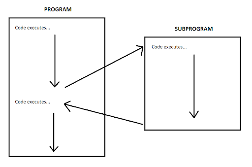

## Terms
[Jump Back](#contents)

In the early years of computer programming languages, where programmers worked with various low-level languages barely a step removed from machine language, the actual implementation of the concept stayed quite simple and very much as described above. However, as higher-level programming languages were developed, this concept began to develop variations and nuances. The central concept of pre-made sets of code that can be used as needed has remained, but the designers of the various languages have often implemented the concept in different ways, depending on the design objectives of the language.

Because of this, you will find many related terms in this area. Some of the terms in use are:

- [Functions](#functions)
- [Methods](#methods)
- Routines
- Subroutines
- [Subprograms](#sub-programs)
- Procedures

At a high-level, these terms mean the same thing but if you try to clear up their definitions, you can quickly become confused. Some sources will tell you that they all basically hold the same meaning. Other sources will articulate specific differences and similarities between two or more of the terms. It can be difficult to nail down.

This is because of a few factors. First, some programming languages use the same term to mean slightly different things. Second, some programming languages are designed to implement this concept in two related ways, so the language designers needed two different terms.

What this means in terms of your study of various computer programming languages is that you’ll often have to research what a specific term means in that language, ignoring source data that’s related to other languages.

This concept is best illustrated through an example. We’ll use the popular programming language JavaScript to do this.

## JavaScript - Related Terms
[Jump Back](#contents)

JavaScript uses two related terms: function and method. They are very similar, in that they both involve the creation of a pre-made set of instructions that can be made use of by other program elements. They do have some subtle but important differences, however. Let’s explore them.

First, some basic definitions – and remember, these definitions are for the use of these terms in JavaScript.

In JavaScript, an “object” is a type of data that represents a thing through its various properties (characteristics – what it looks like) and behavior (what it can do).

An example of an object would be a “vehicle”. Thinking of this common real-world thing as an “object” that will be stored in computer memory and kept track of as a program is executed, we can think of various properties and behavior for it. Under properties, we could have things like “chassis type”, “engine type”, “number of doors”, “speed”, etc. Under behavior, we could have things like “accelerate”, “deccelerate”, “turn right”, “turn left”, etc.

An example of creating an object in JavaScript might look like this:

```js
var student = {
    firstName: "Jane",
    lastName: "Smith",
    age: "28",
    gradeAverage: 3.5
};
```

In this example, we have only specified properties for the “student” object, and not specified any behavior. We will look at that in a moment.

Let’s look at how this applies to methods and functions in JavaScript.

## Functions
[Jump Back](#contents)

A *function* is a repeatable block of code that executes certain actions and performs tasks. You execute a function by calling it. This is also called “invoking” the function (“invoking” means “causing a procedure to be carried out”).

One writes a JavaScript function by stating the keyword “function”, then a name for the function, then parentheses, like this:

```js
function name()
```

Functions are valuable because of code reusability—you can invoke functions over and over. Since functions in JavaScript contain properties and methods, they are basically objects.

Functions are useful so you don’t have to keep retyping code; you can instead simply invoke the function whenever needed.

An example could look like this:

```js 
function add(num1, num2) {
    return num1 + num2;
}
```

Other JavaScript code elements could call this “add” function by specifying its name and passing it two numbers. That could look like this:

```js
var sum = add(5,7);
```

Here, the code would create the variable called “sum”, call the function “add” and pass it the two numbers 5 and 7, and take the result (12) and assign that value to the variable “sum”.

## Methods
[Jump Back](#contents)

In JavaScript, a *method* is a set of code *associated with an object* that is designed to change the state of that object when it executes. In other words, the method is performed *on the object*.

You create these methods when you create the object. Let’s look at how we might do that with our previous example of a “student” object:

```js
var student = {
    firstName: "Jane",
    lastName: "Smith",
    age: 28,
    gradeAverage: function(avg) {
        return avg;
    }
};
```

Here, we aren’t setting the property “gradeAverage” to a fixed number of 3.5. Instead, we are setting that property to the value returned by a set of code. Specifically, that code will take in a number (the variable “avg”) and set the value of the “gradeAverage” property to the value of that variable.

Executing that code could look like this:

```js 
student.gradeAverage(3.4);
```

Here, we are telling the computer to make use of the object called “student”. Specifically, the computer is to run the function “gradeAverage” that is defined in the “student” object. Since that function needs an input (the variable “avg”), we give it the number 3.4.

So here’s the distinction: In this specific situation, that function “gradeAverage” is called a method. Yes, it’s confusing – until you recall that in JavaScript, a method is a set of code, associated with an object, that is performed on the object itself. So we have the confusing situation of a property of an object that we are defining using a *function* – but we’re calling the action performed by the function a *method*.

## Using these Terms
[Jump Back](#contents)

In actual practice, there is very little danger in using these terms interchangeably – and you’ll often find technical sources will do so. But occasionally you’ll find a source that uses the terms in their strictest sense.

The lessons here are these:

1. First, there are many varied terms in use for the concept of “a block of code that can be executed on demand by other code.”
2. Second, in order to clarify any potential difference between these various terms, you’ll need to investigate their exact meaning in the language you’re concerned with.

Any attempt to give them a blanket, universal meaning ignores the subtleties described here.

## `document.getElementById` Method
[Jump Back](#contents)

As a reminder, a “method” is an action that an object can perform. It is a named sequence of events.

The *document.getElementById* method returns (executes and provides relevant output) an element.

An “attribute” is a specification that assigns a property (name; characteristic) to something. Basically, an attribute is metadata (data that describes other data).

The element returned by document.getElementById has an Id attribute with a specific value assigned to it. The Id is a variable.

For an example:

```html
<h1 id="Header_1">This is my heading</h1>
```

We have assigned the h1 element the Id “Header_1”. To run and display (return) this element, we write:

```js 
document.getElementById("Header_1").innerHTML
```

“innerHTML” gets or sets the HTML markup contained within the element.

Document.getElementById is used mainly to control or get information from an element within your code. If it can’t find the element with the specified Id, it will return “null.”

## Creating a Function
[Jump Back](#contents)

Let’s look at creating a function using the `document.getElementById` method:

```html
<!DOCTYPE html>
<html>
    <body>
        <button onclick="My_First_Function()">
            Click Me!
        </button>
        <p id="Irish"></p>
        <script>
            function My_First_Function() {
                var String = "Kiss me, I'm Irish!";
                var result = String.fontcolor("green");
                document.getElementById("Irish").innerHTML = result;
            }
        </script>
    </body>
</html>
```

The above code accomplished the following:

1. Created a button element.
2. Utilized the ID attribute and assigned the paragraph element the value “Irish”.
3. Returned the paragraph element by calling the “Irish” value that we assigned earlier (when writing the ID attribute).

Everything inside our curly brackets `{ }` is our function.

## Node
[Jump Back](#contents)

A *node* is a point where lines meet; it is where paths intersect. There are two main types of nodes:

1. A node is something connected to a network. If several computers are joined together, each computer is considered a node. Here’s what some nodes could look like:
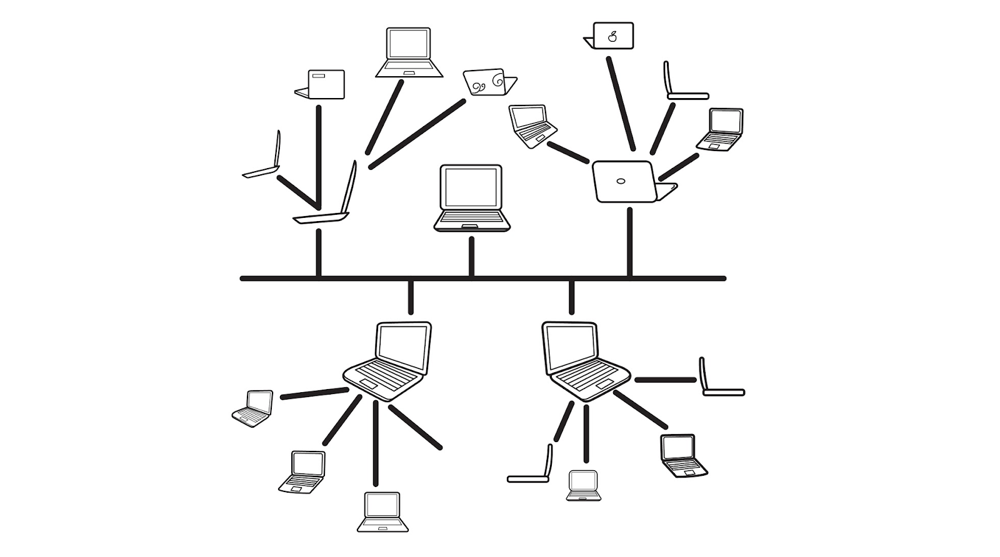

2. In a set of data that is organized into a hierarchical (based on rank) structure, a node is any individual element in that structure. 
Here is an example of this meaning of node: A hierarchical structure might be created that looks like this:
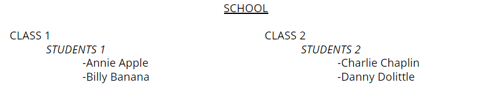

Examples of nodes in this structure are: "class2," "Billy Banana," "students1," "school."


## Trees
[Jump Back](#contents)

A common nonlinear data structure (arrangement of data where the elements of the data don't necessarily follow one after the other) is the tree. Let's take a look at this diagram with some of the important features of trees highlighted.

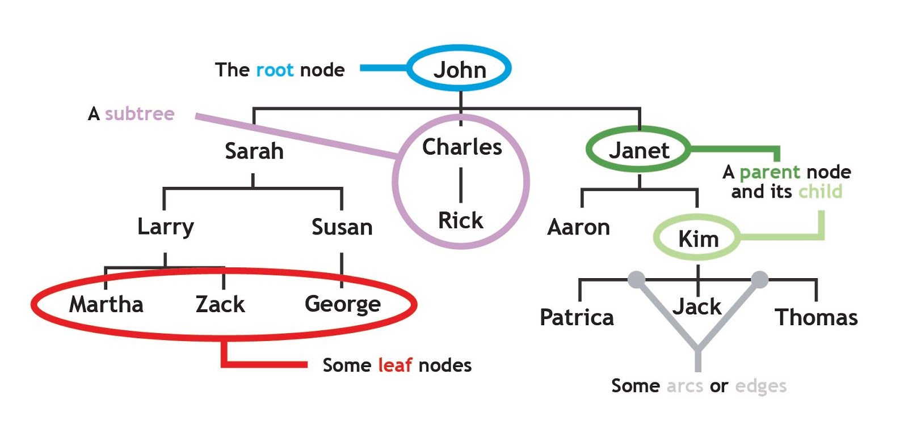

In this diagram, we can see that the starting point, or the root node, is circled in blue. A node is a simple structure that holds data and links to other nodes. In this case, our root node contains the data string "John" and three links to other nodes. Notice that the group of nodes circled in red do not have any links. These nodes are at the ends of the branches and they are appropriately called leaves or leaf nodes. In our diagram, the nodes are connected with solid black lines called arcs or edges. These edges show the relationships between nodes in the tree.

One important relationship is the parent/child relationship. Parent nodes have at least one edge to a node lower in the tree. This node is called the child node. Nodes can have more than one child, but children can only have a single parent. Notice that the root node has no parent, and the leaf nodes have no children. The final feature to note in our diagram is the subtree. At each level of the tree, we can see that the tree structure is repeated. For example, the two nodes representing "Charles" and "Rick" compose a very simple tree with "Charles" as the root node and "Rick" as a single leaf node.

## The Web
[Jump Back](#contents)

We will now cover an element of the Web that can help a developer greatly in their web development tasks.

First, let’s review some fundamentals of the Web. You will have learned much of this already but there’s going to be some new data.

The *Web* is a collection of linked electronic documents. These documents, called “web pages,” are precisely formatted text documents that define the content and appearance of a visual display of the web page.

These web page documents are written in a specialized type of computer language called a “markup language.” This is a computer language whose instructions are used to tell the computer how to display and format visual elements.

One aspect of markup language instructions is that they reside in the same document as the content that they affect, and the instructions can be differentiated from that content.

There are several markup languages in use in computer programming. The one used in web development is Hyper Text Markup Language.

## HTML and the Web
[Jump Back](#contents)

As we’ve covered, HTML uses instructions called “tags” to alter the format and appearance of displayed content and the combination of a tag and its associated content is called an “element”.

The basic operation of the Web is this:

- A person uses a computer program on their computer called a web browser.
- They instruct their browser to request a specific web page.
- The browser sends a request to the web server where that web page is stored. Again, the web page is an HTML file.
- The web server sends the web page back to the browser.
- The browser processes the HTML in the web page and renders a visual display based on the HTML.

Usually, HTML documents are created by hand by programmers. Often, though, programmers have a need to change these HTML files programatically – that is, to change the markup instructions and/or the content based on logic contained in a computer program.

## REPL
[Jump Back](#contents)

REPL is short for read-eval-print-loop.

A REPL is a simple, interactive computer programming environment that allows developers to write code and see a near-immediate result.

The REPL takes input, evaluates (executes) it, and returns the result to the user. They’re much simpler than IDEs but have much less to offer in terms of functionality and tools.

**Example**
>Here is a REPL provided by w3schools:

>[Tryit Editor v3.6](https://www.w3schools.com/html/tryit.asp?filename=tryhtml_default)

## API (Application Programming Interface)
[Jump Back](#contents)

Programmers need an interface that can expose the form and content of any given HTML document in such a way that a computer program can analyze and modify the document as needed.

In other words, they need an API – an Application Programming Interface – for the web page.

In simple terms, an API is a system that allows one program to talk to another. Here, what is needed is a tool that can scan an HTML document and then create a representation of that document that other programs can interact with.

## DOM and HTML
[Jump Back](#contents)

The interface for HTML documents exists and it is called the Document Object Model, or the DOM. It is pronounced “dom,” not “dee-oh-em.”

The middle word is “object” and in its simplest form, an object is just “something the computer is keeping track of.” Usually it’s a variable, or a data structure, or similar item. It’s essentially a value stored in computer memory, so it has a location and an identifier that can be used to identify and use it.

So the DOM is a model of the various objects in the HTML document – a document object model.

The DOM presents the HTML document as a tree structure, where each node in the tree is an object representing a part of the HTML document.

Take a look at this HTML code:

```html
<html>
    <head>
        <title>
            My Title
        </title>
    </head>
    <body>
        <h1>A heading</h1>
        <a href="https://www.learncodinganywhere.com">Link text</a>
    </body>
</html>
```

Here is an example of a Document Object Model for this HTML code:


## DOM
[Jump Back](#contents)

A DOM for an HTML page is generated by specialized computer programs. These programs scan through an HTML file, locating the various elements in the page described by that file, and then they create the tree structure that represents the unique arrangement of elements on that page. That tree structure, the DOM, is itself then held in computer memory.

Once the DOM is generated for a particular HTML document, other programs can access the Object Model and the various parts of the document that are represented in it. They can get data about the various elements on the page, and can even modify the page.

Let’s look at some examples of how this could be done, using pseudocode.

Suppose you wanted to find all paragraph elements in an HTML document. You might use code like this:

```js
var foo = document.getElementByTagName("p");
```

The variable called “foo” would now contain a collection of all the paragraph tags in the document.

Many different programming languages can be used to work with the DOM. One of the most common is JavaScript; in fact, the code example above is actually JavaScript.

## DOM and Elements
[Jump Back](#contents)

The DOM allows you to locate elements in an HTML document in several ways. You can search for elements by their class name or their id. You can locate elements that are organized in a collection, such as those inside a `<form>` element. Many other parts of the HTML webpage are accessible as DOM objects, such as:

- body
- head
- anchors
- images
- title
- scripts

and more.

Having the DOM also opens up the ability to change the HTML for a web page, or to generate HTML entirely from scratch. In fact, an entire web page could be created by a program, only coming into existence after a DOM for it is constructed.

Most browsers generate a DOM for the web pages they display, and most browsers allow you to look at that DOM. Most browsers have built-in tools to help web developers; they are generally called “developer tools.”

## Accessing the DOM
The DOM can be accessed by opening up these developer tools in your browser.

Let’s look at an example of this, using the web browser Chrome. You can open Developer Tools in Chrome by right-clicking on a web page and clicking “Inspect.” A second window will open up, showing a great deal of information about the web page and the browser. There are tabs in this window that let you select what you’d like to view. The DOM is viewable in the “Elements” tab.

For our HTML in the previous step, the DOM would look like this from within those Developer Tools in Chrome:

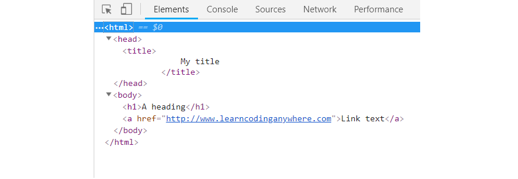

This looks much like the actual HTML from the web page file itself – but it’s actually a tree structure that represents the structure of the various objects that make up the web page. The “down arrows” in the display of the DOM are a graphical interface that lets you expand and collapse the individual nodes on the tree structure of the DOM.

Many browsers even let you edit the DOM from within these tools and see those changes reflected immediately in the displayed web page – but it’s important to know that those changes aren’t being made to the actual stored HTML files that were given to the browser - you’re only changing the DOM that the browser is creating and using to create the display. In order to permanently change the web page, you’ll need to change the actual files that will be given to the browser.

There is a lot more to know about the DOM, and as you do more web development, you’ll pick up a lot more knowledge and skill. But you now have the basic principles and application of the DOM.

## Type of Font
[Jump Back](#contents)

To assign the type of font you want to utilize, use the face attribute within the font element, like this:

```html
<font face="Arial">This text is written in Arial font!</font>
```

Here are some example fonts you can use:

- Verdana
- Comic Sans MS
- Trebuchet MS
- Arial Black
- Impact

As a note: if you want to change the font color and type of font within the same font element, you write your HTML code like this (putting both attributes within the font opening tag):

```html
<p>
    <font color="orange" face="Calibri">
        This orange text is written in Calibri.
    </font>
</p>
```

In fact, we can also specify the font size as well, like this:

```html
<p>
    <font color="purple" face="Roboto" size="7">
        This purple text is written in Roboto.
    </font>
</p>
```

The size attribute uses sizes from 1 to 7 – the default browser size is 3.

NOTE: The face attribute is not HTML5 but comes from an earlier version of HTML. We are teaching you how to do some styling using HTML to help with your comprehension of this language. Please keep in mind that when you learn CSS later on this course, that it is best practice to handle all styling (including fonts) with CSS.

## Browser Engines
[Jump Back](#contents)


An “engine” is the central part of a computer program.

A “browser engine” is the core software component of every major web browser. The primary job of browser engines is to transform HTML documents and other resources of a web page into an interactive visual representation on a user's device.

## Web Browsers
[Jump Back](#contents)

The primary function of a web browser is to request resources from the Web and display them inside of a browser window. Typically a browser will request HTML, CSS, JavaScript and image content from a server and interpret them based on standards and specifications for the Web. They follow standards because it allows websites to behave the same way across all browsers, and creates less work and fewer difficulties for web developers.

There are seven main components to any web browser:

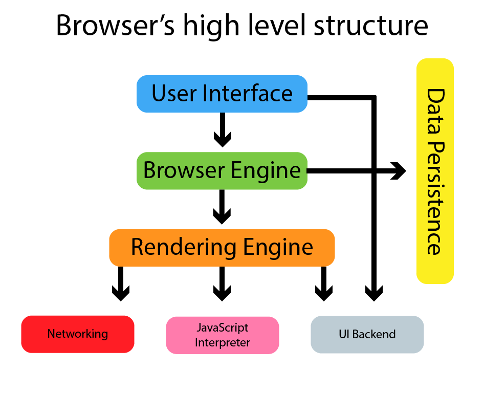

1. User Interface: The user interface of the browser includes all of the visual components of the browser with the exception of the display of the requested page. For example, the address bar, bookmarks bar and navigation buttons are all part of the User Interface.
2. Browser Engine: The browser engine is responsible for organizing actions between the UI and Rendering Engine.
3. Rendering Engine: “Render” literally means “to cause to be; make.” A rendering engine takes HTML code and interprets it into what you see visually. For example: a `<bold>` tag would be interpreted by the rendering engine as a set of instructions to make the text inside the element bold.
4. JavaScript Interpreter: The JavaScript interpreter takes JavaScript code, parses (analyzes and reads the code) it, executes it, and returns the results.
5. Networking: This is a function of the browser that happens behind the scenes and handles network functions such as encryption (concealing data by altering it into a secure format), requests, and all network settings such as HTTP.
6. Data Persistence: Browser’s must store some data which can include cached files and cookies.
7. UI Backend: The browser interacts with the operating system to display several elements of the page, like drop down boxes and some icons on the window (close, maximize, and minimize buttons).


## Rendering
[Jump Back](#contents)

The rendering engine displays what you see on your screen. It receives HTML code and other items passed from a server and then creates the Document Object Model (DOM).

The rendering engine creates a DOM tree like this from the code received:

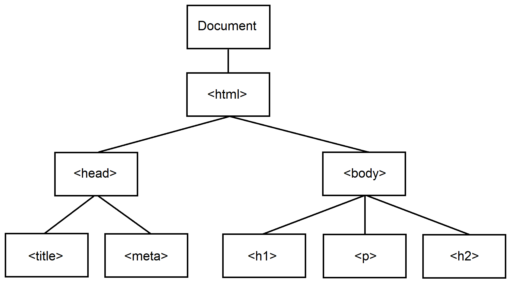

Though, technically, the DOM (render tree) would look like this:

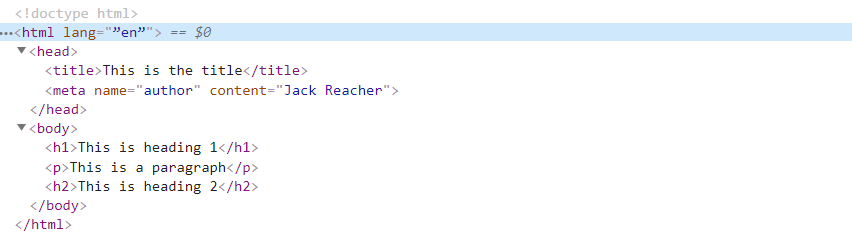

**Note**
> In this image, $0 is included. That is a command specific to Google Chrome.

> The $0, $1, $2, $3 and $4 commands work as a historical reference to the last five DOM elements inspected within the Elements panel or the last five JavaScript heap objects selected in the Profiles panel. $0 returns the most recently selected element or JavaScript object, $1 returns the second most recently selected one, and so on.

> You can read Google’s documentation on this here:

> [Chrome DevTools](https://developers.google.com/web/tools/chrome-devtools/console/utilities?utm_source=dcc&utm_medium=redirect&utm_campaign=2016q3#dom)


## Nested Tags
[Jump Back](#contents)

Since there is often a need to format content within other tags, the tags can be "nested”, meaning one tag can include other tags.

Here’s an example of HTML where tags are nested within other tags:

```html
<!DOCTYPE html>
<html>
    <head>
        <title>This title tag is nested within the head tag.</title>
    </head>
    <body>
        <h1>This heading tag is nested withing the body tag.</h1>
    </body>
</html>
```

## CSS
[Jump Back](#contents)

*Cascading Style Sheets* are electronic files containing information that is used to control the appearance of the text, images, video, etc. on those web pages.

A *style sheet* is a tool used to design the format of a webpage. Style sheets are a central place to store data about how that page will appear and how it will behave. It can be used to store information about how to display colors, pictures, text, etc. It is an electronic file with information that controls the style of the website.

Styling is not concerned with the content (text, pictures, videos, etc.) on a web page; rather, it is concerned with the appearance of that content.

*Cascading* is a term that comes from the idea of water dropping down a series of drops in height. Think of it as a series of small waterfalls. Information can cascade, meaning it can be stored at one central, most important location and then apply to other locations that are considered to be lower than, or derived from, that more important central location.

In Cascading Style Sheets, the people who make a website can create one master style sheet for all web pages in the site. Unless otherwise specified, the style information from the master CSS sheet will ‘cascade’ - meaning it will apply to any new web pages that are created. You can, if you like, create specific styling on a page that will override the styling from the CSS style sheet.

This is a benefit to the people making the website because if they want to change any of the things that they set up in the style sheet, they only have to change it in one place, and those changes will be applied to all pages in the website at once.

CSS3 is the newest version of CSS.


## Aesthetics
[Jump Back](#contents)

“Aesthetic” means “concerned with being attractive; the appreciation of beauty”.

CSS and JavaScript can be used to increase the aesthetic (how visually appealing something is) of a website.

CSS describes the style of an HTML document and defines how HTML elements should be displayed.

Like JavaScript, CSS files (called style sheets) are kept in a separate file from your main HTML code. For example: You might have 10 different web pages on your website, each saved in a different HTML file, but only one style sheet that determines the styling (colors, backgrounds, etc.) of all of those web pages.

That way if you want to change the aesthetics of your website, you can simply edit your style sheet.

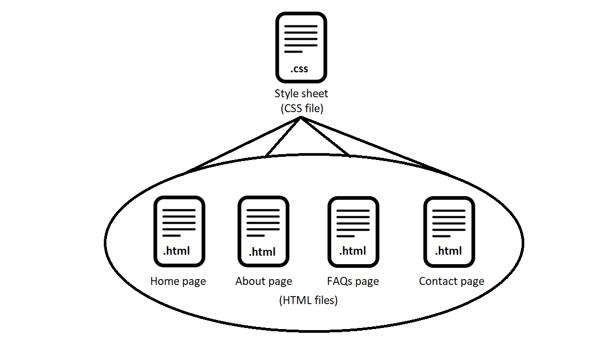

## Selectors, Properties and Values
[Jump Back](#contents)

In CSS, a “selector” points to the HTML elements you wish to style.

A “property” is an identifier; a name. The property explains what feature is being considered.

A “value” describes how the feature is handled.


In this picture, we are selecting the `<p>` element and stating we want to color the text within it blue.

## CSS Rule-Set
[Jump Back](#contents)

A CSS “rule-set” is a block of CSS code that contains:

1. **Selector** – this points to the HTML element that you want to style.

2. **Declaration** – a statement that consists of a property and a value.

This is a CSS rule-set:

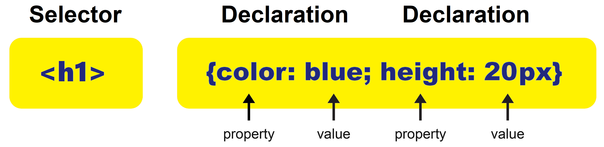

As a note: px stands for CSS pixels. For example: a 96px line would be one-inch long. Font size 10 in a word processor is about 13pxs. It is a unit of measurement to define size (width, length, etc.) in CSS.

The declaration block contains one or more declarations separated by semicolons. Each declaration includes a CSS property name and a value that is separated by a colon. A CSS declaration always ends with a semicolon. Declaration blocks are surrounded by curly braces.

## HTML and CSS
[Jump Back](#contents)

Review the following code:

```html
<!DOCTYPE html>
<html>
    <head>
        <style>
            p {
                color: green;
                text-align: right;
            }
        </style>
    </head>
    <body>
        <p>Hey! Over Here!</p>
        <p>These Paragraphs are styled with CSS.</p>
    </body>
</html>
```

The output of this code would be:

<head>
    <style> /* Added class to stop changing the entire document */
        .p1 {
            color: green;
            text-align: right;
        }
    </style>
</head>
<body>
    <p class="p1">Hey! Over Here!</p>
    <p class="p1">These Paragraphs are styled with CSS.</p>
</body>


You can change the colors by typing in different values after the color property (such as red or blue). You can change the alignment of text by typing various values after the text-align property (like center).

Note that in the above code, the CSS rule-set is nested within the HTML `<style>` tags.

## HTML5
[Jump Back](#contents)

HTML5 was designed to encourage that CSS be utilized for styling.

For example: the font attributes color, size and face that we covered earlier on the course aren’t supported by HTML5. Meaning, they were a part of earlier versions of HTML and are not included in HTML5 documentation. They can still be run in the browser because most browsers support all versions of HTML.

The point is
: *it is a best practice to have all styling contained within style sheets (CSS).*


## List of Colors
[Jump Back](#contents)

Here is a list of CSS colors:

[CSS Colors](https://www.w3schools.com/cssref/css_colors.asp)

## External Style Sheets
[Jump Back](#contents)

As we mentioned earlier, CSS can be saved in a different file than one’s HTML code. This is actually recommended. We do this in a similar way to how we did it with JavaScript:

```html 
<link rel="stylesheet" type="text/css" href="">
```

In HTML, there’s a `<link>` element that defines a link between a document and an external resource. It is common to use `<link>` tags to link to a style sheet.

“Rel” is short for “relationship”. Rel is an attribute (word used inside an element’s opening tag that controls its behavior) that specifies the relationship between two documents. For example: if you wanted to specify that you were linking to the help page on your website, you’d write:

```html
<link rel="help" href="https://www.yourwebsitename.com/help/">
```

“Stylesheet” is a common value used following the rel attribute. The stylesheet value imports the specified stylesheet.

Type is an attribute of the `<link>` element that tells the browser the kind of resource you are linking to. For example: if you were linking to an audio file, you would write type=“audio” within the element. When linking CSS files, we use the type value “text/css”.

As a reminder “href” is short for “hypertext reference” and it specifies the link’s destination (address).

## Linking Style Sheets
[Jump Back](#contents)

Earlier we displayed HTML and CSS code contained within the same file as follows:

```html
<!DOCTYPE html>
<html>
    <head>
        <style>
            p {
                color: green;
                text-align: right;
            }
        </style>
    </head>
    <body>
        <p>Hey! Over here!</p>
        <p>These paragraphs are styled with CSS.</p>
    </body>
</html>
```

To separate our HTML code from our CSS, we would do the following:

1. Create a new file and write the following code within it (this is a CSS rule-set that assigns “green” and “right” values to the color and text-align properties respectively):

```css
p {
    color: green;
    text-align: right;
}
```

Then we'd save this file as `My_Style.css`.

2. Next we would create a new file and write the following code in it:

```html 
<!DOCTYPE html>
<html>
    <head>
    <link rel="stylesheet" type="text/css" href="My_style.css">            
    </head>
    <body>
        <p>Hey! Over Here!</p>
        <p>These paragraphs are styled with CSS.</p>
    </body>
</html>
```

## Classes and Objects
[Jump Back](#contents)

There is a concept in creating a computer program called “classes”.

A class is an object, created from the mind of the computer programmer, that represents a type of thing the programmer wants to represent in the computer program.

Examples of objects include things like “integer”, “string”, “Student”, “Teacher”, etc.

Classes are not actually objects themselves. Instead, they provide a template that actual objects can be created from. The programmer defines the structure of a potential object, as well as the behaviors available to that potential object.

This action of creating an actual example of the object defined by a class is called “instantiation”, and the created object is called an “instance” of the class.

Objects so created can also be referred to as a “class object” or “class instance.”

You can think of the class definition as an answer to the question of, “If I were a [type of object], what would I look like and what could I do?” Here, “what would I look like” refers to the structure of the potential object, and “what could I do” refers to the behavior of the potential object.


## Class Attribute
[Jump Back](#contents)

The HTML class attribute is used to define equal styles for all elements with the same class name. HTML elements with the same class attribute have the same format and style.

For example: we could utilize the class attribute if we wanted to have two different styles of paragraphs.

You assign a class name by writing `.classname` (a period followed by a class name of your choosing).

Here is an example of how to create two styles using the class attribute:

```html
<style>
    .font_1 {
        background-color: black;
        color: yellow;
        font-size: large;
    }
    .font_2 {
        background-color: darkblue;
        color: white;
        font-size: medium;
    }
</style>
```


We created two class names: `.font_1` and `.font_2`. The class attribute specified the class names.

By pointing to the class name “font_1” or “font_2” we can specify the styling of our font.

This is how:

```html
<!DOCTYPE html>
<html>
    <body>
        <style>
        .font_1 {
            background-color: black;
            color: yellow;
            font-size: large;
        }
        .font_2 {
            background-color: darkblue;
            color: white;
            font-size: medium;
        }
        </style>
        <h2 class="font_1">This h2 element is styled per class attribute font_1</h2>
        <h3 class="font_2">This h3 element is styled per class attribute font_2</h3>
        <h4 class="font_1">Even though this is a h4 element, it is styled the same as the h2 element because we pointed to the class attribute font_1</h4>
    </body>
</html>
```

Here would be the output of our code:

<body>
    <style>
    .font_1 {
        background-color: black;
        color: yellow;
        font-size: large;
    }
    .font_2 {
        background-color: darkblue;
        color: white;
        font-size: medium;
    }
    </style>
    <h2 class="font_1">This h2 element is styled per class attribute font_1</h2>
    <h3 class="font_2">This h3 element is styled per class attribute font_2</h3>
    <h4 class="font_1">Even though this is a h4 element, it is styled the same as the h2 element because we pointed to the class attribute font_1</h4>
</body>

Another action we can take with the class attribute is assigning style to particular elements. For example:

```html
<style>
    h1 {
        background-color: yellow;
    }
    p {
        color: blue;
    }
</style>
```

This would make it so that all `<h1>` elements had a yellow background and that all `<p>` elements are blue.

This is what the code looks like exactly:

```html
<!DOCTYPE html>
<html>
    <body>
        <style>
                h1 {
                    background-color: yellow;
                }
                p {
                    color: blue;
                }
        </style>
        <h1>Yellow Background.</h1>
        <h2>Default styling.</h2>
        <p>Blue font.</p>
    </body>
</html>

```

The output of our code would look like this:

<html>
    <body>
        <style>
                .h1 {
                    background-color: yellow;
                }
                .p {
                    color: blue;
                }
        </style>
        <h1 class="h1">Yellow Background.</h1>
        <h2>Default styling.</h2>
        <p class="p">Blue font.</p>
    </body>
</html>

## Class in External File
[Jump back](#contents)

Let’s try keeping our class in a separate file. To do this, we would first write a new css file as follows:

```css
body {
    font-style: italic;
    text-align: center;
}

.Class_A {
    color: blue;
}
```

This code states that anything within the <body> element will be written in italics and centered on the page. We’ve also created our class name (Class_A) and stated that any element connected to that class name will have its text written in blue. Let’s say we saved the file as Class_A.css.

Here is what the separate HTML file would look like:

```html
<!DOCTYPE html>
<html>
    <head>
        <link rel="stylesheet" type="text/css" href="Class_A.css">
    </head>
    <body>
        <h1 class="Class_A">Good morning!</h1>
        <h2>Good Afternon!</h2>
        <h3 class="Class_A">Good night!</h3>
    </body>
</html>
```

The output of this code would look like this:

<html>
    <head>
        <style>
            #cody {
                font-style: italic;
                text-align: center;
            }
            .Class_A {
                color: blue;
            }
        </style>
    </head>
    <div id="cody">
        <h1 class="Class_A">Good morning!</h1>
        <h2>Good Afternon!</h2>
        <h3 class="Class_A">Good night!</h3>
    </div>
</html>

Notice that “Good afternoon!” is written in default black (not blue) because we didn’t utilize the class name with it.

## Commenting Code
[Jump back](#contents)

It is highly recommended that you write comments throughout your code that explains what each section of it is meant to do. This enhances the ability of other developers to read through and understand your code, and can also remind you of things in the future.

An HTML comment begins with `<!––` and closes with `––>`. HTML comments are visible to anyone that views the page source code, but are not rendered when the HTML document is rendered by a browser.

Meaning, you don’t see the comments when viewing the website in the browser but you can see them when you utilize Chrome’s dev tools.

An example of commenting HTML code is as follows:

```html 
<!DOCTYPE html>
<html>
    <head>
        <style>
            .Red {
                color: red;
            }
            .Blue {
                color: blue;
            }
        </style>
        <title>Monsters and Beasts!</title>
    </head>
    <!-- This section is about dragons -->
    <body>
        <p>Some dragons can breathe fire and others breathe ice!</p>
        <p class="Red">Here is a fire dragon!:</p>
            
        <p class="Blue">Here is the ice dragon!:</p>
            
        <p>You can read about the Game of Thrones dragons here:</p>
            <a href="https://gameofthrones.fandom.com/wiki/Dragons">
                Game of Thrones dragons
            </a>
    </body>
</html>
```

The output of this code would be:

<html>
    <head>
        <style>
            .Red {
                color: red;
            }
            .Blue {
                color: blue;
            }
        </style>
        <title>Monsters and Beasts!</title>
    </head>
    <!-- This section is about dragons -->
    <body>
        <p>Some dragons can breathe fire and others breathe ice!</p>
        <p class="Red">Here is a fire dragon!:</p>
            
        <p class="Blue">Here is the ice dragon!:</p>
            
        <p>You can read about the Game of Thrones dragons here:</p>
            <a href="https://gameofthrones.fandom.com/wiki/Dragons">
                Game of Thrones dragons
            </a>
    </body>
</html>

>Note that the comments aren’t displayed.

### CSS Comments
To write comments within your CSS code, you use.

```css
/* Write comment here */
```

## HTML Tables
To create a table in HTML, we use the `<table>` tag.

Rows are created with the `<tr>` tag (table row).

Table headers are created with the `<th>` tag. Table headers are bold and centered by default.

Table data (cells) are created with the `<td>` tag.

For example, look at this table:

<html lang="en">
    <body>
        <h1>Game of Thrones table</h1>
        <table style="width: 100%">
            <tr>
                <th>Name</th>
                <th>Phone Number</th>
                <th>Email</th>
                <th>Notes</th>
            </tr>
            <tr>
                <td>Jon Snow</td>
                <td>5032343966</td>
                <td>winterishere@thenorth.com</td>
                <td>King of the North</td>
            </tr>
            <tr>
                <td>Daenerys Targaryen</td>
                <td>9712343966</td>
                <td>motherofdragons@ironthrone.com</td>
                <td>The mad queen.</td>
            </tr>
        </table>
    </body>
</html>

To create this in HTML, we would write the following code:

```html
<!DOCTYPE html>
<html lang="en">
    <body>
        <h1>Game of Thrones table</h1>
        <table style="width: 100%">
            <tr>
                <th>Name</th>
                <th>Phone Number</th>
                <th>Email</th>
                <th>Notes</th>
            </tr>
            <tr>
                <td>Jon Snow</td>
                <td>5032343966</td>
                <td>winterishere@thenorth.com</td>
                <td>King of the North</td>
            </tr>
            <tr>
                <td>Daenerys Targaryen</td>
                <td>9712343966</td>
                <td>motherofdragons@ironthrone.com</td>
                <td>The mad queen.</td>
            </tr>
        </table>
    </body>
</html>
```

## HTML Lists
[Jump Back](#contents)

In HTML, there are two main types of lists:

1. *Ordered* lists
2. *Unordered* lists

An ordered list is given in a sequence. An unordered list isn’t given a sequence and is usually bullet points.

Here would be an example of an ordered list:

1. Bread
2. Milk
3. Eggs
4. Cheese

While this would be unordered:

- Cats
- Dogs
- Snakes
- Birds

To create an ordered list, we use the `<ol>` tag. Each item on the list is contained within the list element `<li>`. In the earlier example, this would be written as:

```html
<ol>
    <li>Cats</li>
    <li>Dogs</li>
    <li>Snakes</li>
    <li>Birds</li>
</ol>
```

To create an unordered list, we use the `<ul>` tag. The earlier example would be written as:

```html
<ul>
    <li>Cats</li>
    <li>Dogs</li>
    <li>Snakes</li>
    <li>Birds</li>
</ul>
```

## Styling Tables with CSS
[Jump Back](#contents)

The table we made earlier was pretty bland. We can enhance it with CSS.

First, here is our earlier HTML code for a table:

```html
<!DOCTYPE html>
<html lang="en">
    <body>
        <h1>Game of Thrones table</h1>
        <table style="width: 100%">
            <tr>
                <th>Name</th>
                <th>Phone Number</th>
                <th>Email</th>
                <th>Notes</th>
            </tr>
            <tr>
                <td>Jon Snow</td>
                <td>5032343966</td>
                <td>winterishere@thenorth.com</td>
                <td>King of the North</td>
            </tr>
            <tr>
                <td>Daenerys Targaryen</td>
                <td>9712343966</td>
                <td>motherofdragons@ironthrone.com</td>
                <td>The mad queen.</td>
            </tr>
        </table>
    </body>
</html>
```


Here is some CSS code we can use to enhance the aesthetic of the table:

- Border property (this adds a border around the cells)
- Hover selector (this highlights the table as its hovered over)
- Background-color (this changes the background color of rows)

To beautify it, we would create a new, separate CSS file and call it “CSS_Table.css”.

Here is the code we would write to add a silver border around the cells of the table (we are making it one px thick):

```css
table {
    border: 1px solid silver;
}
```

To add the hover effect, we write:

```css
td:hover {
    background-color: yellow;
    color: black;
}
```

(This will make it so that the background color of the cells will turn to yellow and the font to black when we hover the mouse over them).

To make the top row have a black background and font written in cornsilk (very light yellow) we write:

```css
tr, th {
    background-color: black;
    color: cornsilk;
}
```

And finally, to make the remaining rows have a dark green background and white font, we write:

```css
tr, td {
    background-color: darkgreen;
    color: white;
}
```

Together, all of the code in our CSS file would look like this:

```css
table {
    border: 1px solid silver;
}
td:hover {
    background-color: yellow;
    color: black;
}
tr, th {
    background-color: black;
    color: cornsilk;
}
tr, td {
    background-color: darkgreen;
    color: white;
}
```

Now we need to link our CSS file with our HTML file, so we go back to our HTML code and add:

```html
<link rel="stylesheet" type="text/css" href="CSS_table.css">
```

## CSS Free Fonts
[Jump Back](#contents)

Here is a great list of free fonts from Google that you can utilize when styling with CSS:

[Google Fonts: Browse Fonts](https://fonts.google.com/)

## CSS Lists
[Jump Back](#contents)

We can also style lists with CSS. For example: the following CSS code can change an ordered list from 1., 2., 3. to Roman numerals:

```css
ol {
    list-style-type: upper-roman;
}
```

And to make an unordered list from circular bullet points to squares, we write:

```css
ul {
    list-style-type: square;
}
```

To add these effects to our code, we would first save the above CSS code as a separate .css file.

Then we would link our HTML document to the new CSS file.

## CSS Properties
[Jump Back](#contents)

As a note, here is a complete list of CSS properties:

[CSS Properties Reference](https://www.w3schools.com/cssref/)

There are two important points to keep in mind:

1. No one expects you to memorize the complete syntax of every programming language. Working developers spend a lot of time online looking up code, finding solutions and debugging. For example: after you graduate, it’s completely normal to Google questions like, “How to insert an image in HTML?” or “How to add a CSS border to a webpage?” – even senior-level developers with decades of experience operate this way.

2. It would take months to cover all HTML and CSS code. What’s important is that you understand the basics and can self-teach yourself in the future – both will be achieved on this course.

You’ve accomplished quite a lot already – well done!

Let’s continue.

## Line Break
[Jump Back](#contents)

A line break refers to starting text on a new line. It’s like pressing “ENTER” in a word processor. Take a look at this text:

>Two roads diverged in a yellow wood,
And sorry I could not travel both
And be one traveler, long I stood
And looked down one as far as I could
To where it bent in the undergrowth;

>Then took the other, as just as fair,
And having perhaps the better claim,
Because it was grassy and wanted wear;
Though as for that the passing there
Had worn them really about the same,

>And both that morning equally lay
In leaves no step had trodden black.
Oh, I kept the first for another day!
Yet knowing how way leads on to way,
I doubted if I should ever come back.

>I shall be telling this with a sigh
Somewhere ages and ages hence:
Two roads diverged in a wood, and I—
I took the one less traveled by,
And that has made all the difference.

Did you know you could write all of that using just one `<p>` element? This is how:

```html
<p>
    Two roads diverged in a yellow wood,<br>And sorry I could not travel both<br>And be one traveler, long I stood<br>And looked down one as far as I could<br>To where it bent in the undergrowth;<br>Then took the other, as just as fair,<br>And having perhaps the better claim,<br>Because it was grassy and wanted wear;<br>Though as for that the passing there<br>Had worn them really about the same,<br>And both that morning equally lay<br>In leaves no step had trodden black.<br>Oh, I kept the first for another day!<br>Yet knowing how way leads on to way,<br>I doubted if I should ever come back.<br>I shall be telling this with a sigh<br>Somewhere ages and ages hence:<br>Two roads diverged in a wood, and I—<br>I took the one less traveled by,<br>And that has made all the difference.<br>
</p>
```

Now, that code is not very orderly, so for appearance’s sake, we’d write it more like:

```html
<p>
    Two roads diverged in a yellow wood,<br>
    And sorry I could not travel both<br>

    etc.
...
```

## Span
[Jump Back](#contents)

Inline (also written in-line) refers to code contained within the webpage. The opposite of inline is code kept in an external file (like a URL or an external style sheet).

The `<span>` tag connects inline elements and provides a way to connect text. It literally spans (stretches across) a section of code. Here’s an example:

```html
<p>
    His wife has <span style="color: green; font-weight: bold;">green</span> eyes,
    his children have <span style="color: blue; font-weight: bold;">blue</span> eyes,
    but his eyes were <span style="color: #594c26; font-weight: bold;">hazel.</span>
</p>
```


The resulting output would be:

<p>
    His wife has <span style="color: green; font-weight: bold;">green</span> eyes,
    his children have <span style="color: blue; font-weight: bold;">blue</span> eyes,
    but his eyes were <span style="color: #594c26; font-weight: bold;">hazel.</span>
</p>


## Section
[Jump Back](#contents)

As the name sounds, the `<section>` tag designates sections in a document, such as headers, footers, chapters, or any other sections of the document.

Here’s an example:

```html
    <!-- This section is about cats -->
    <section>
        <h1>Cats</h1>
        <p><span style="font-style: italic; font-weight: bold;">As every cat owner knows, nobody owns a cat.</span><br>-Ellen Perry Berkeley</p>
    </section>

    <!-- This section is about dogs -->
    <section>
        <h1>Dogs</h1>
        <p><span style="font-style: italic; font-weight: bold;">Petting, scratching, and cuddling a dog could be as soothing to the mind and heart as deep mediation and almost as good for the soul as prayer.</span><br>-Dean Koontz</p>
    </section>
```

The output of this code looks like this:

<!-- This section is about cats -->
<section>
    <h1>Cats</h1>
    <p><span style="font-style: italic; font-weight: bold;">As every cat owner knows, nobody owns a cat.</span><br>-Ellen Perry Berkeley</p>
</section>
<!-- This section is about dogs -->
<section>
    <h1>Dogs</h1>
    <p><span style="font-style: italic; font-weight: bold;">Petting, scratching, and cuddling a dog could be as soothing to the mind and heart as deep mediation and almost as good for the soul as prayer.</span><br>-Dean Koontz</p>
</section>

## Non-Breaking Space
A common character entity used in HTML is the non-breaking space – written like this: `&nbsp;`

A non-breaking space is a space that will not break into a new line. Two words separated by a non-breaking space will stick together. This can be useful when breaking the words might be disruptive.

For example:


would ensure that the output is:

**3:11 p.m.**

As opposed to:

**3:11**
**p.m.** (or something)

Additionally, browsers automatically default multiple spaces down to 1. For example: if you write 12 spaces, the browser will delete 11 of them.

You can try it out for yourself but here’s an example:

```html
<p>         Here's              Johnny          !</p>
```

will display as:

**Here’s Johnny !**

`&nbsp;` can tell the browser to leave extra spaces in place.

If we wanted to start every sentence with two spaces, we would write:

```html
<p>&nbsp;Sentence.</p>
```

## HTTP
[Jump Back](#http-messages)

As we’ve covered before, the Internet is a collection of networked computers around the world, and protocols for the exchange of various types of data between those networked computers. One of the primary uses of the Internet is to permit the existence and use of the World Wide Web (the web), a collection of linked electronic documents.

The protocol used to exchange these linked electronic documents between the computers of the Internet is the Hypertext Transfer Protocol (HTTP).

We will now explore how that protocol works, and some ways to use it to make your computer programs more valuable.

## Clients and Servers
[Jump Back](#http-messages)


The web is set up as a client/server system. The client computers are usually personal computers that make use of a program called a web browser. The client requests various resources needed to display web pages on the user’s computer.

The server provides these resources to its clients. These resources are static items like HTML files, images, videos, etc.; and dynamic items produced as a result of executing a program or part of a program

The browser receives these resources from the web server and uses them to create a visual interface for the user.

This entire system works through passing messages back and forth between the client computer and the server computer. These messages are just text, but they are formatted in an exact way. Both the client software (the browser) and the server software (the web server) are programmed to process these HTTP messages.

The cycle is this:

1. The client (browser) submits an HTTP message to the web server application on the server. This message is called the "HTTP Request message".

2. The web server processes that request. It gathers any static resources requested, and executes any programs requested, and then gathers the output of those programs. The web server takes that output, and the static resources, and sends them back to the browser in an HTTP message. This message is called the "HTTP Response message".

3. The client (browser) receives that response. It parses (scans through and processes) the message, including all the resources that came with it, and uses those resources to produce a visual interface for the user.

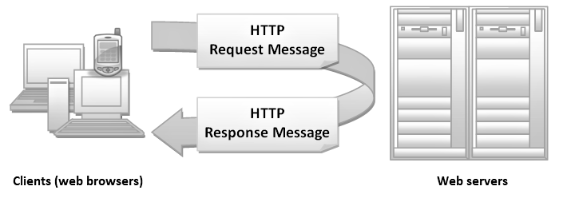 

## Message Format
[Jump Back](#http-messages)


HTTP messages have a simple format. It's the same format whether the message is a request or a response. It has four sections:

1. "Start Line"
2. "Headers"
3. [empty line]
4. "Body" [optional]

What do these parts do?

1. The "Start Line" section describes the message.
2. The "Headers" section contains attributes.
3. The empty line is a separator to tell the programs working with this data that the header section is done. This is needed because the number of lines in the header is variable.
4. The "Body" section is optional. It is used to include data with the message.

These four parts are always in this exact order, but they are used in different ways depending on whether the message is a request message or a response message.

## Request Message
[Jump Back](#http-messages)


The request message needs to answer four basic questions:

1. What resource is this request concerned with?
2. What do you want to do with that resource?
3. How do you want to modify this request from the default, if at all?
4. Is there additional data you'd like to send along with this request that will be needed to complete the request and generate a response?

The "additional data" item is data that the server will need in order to do its job. An example would be the data collected from an HTML form.

There are several terms used to refer to this additional data: "body", "content", "entity", or "object".

## HTTP Verbs
[Jump Back](#contents)
Here, the word "verbs" refers to an exact command given in the request that controls what the server will do when it gets the request.

These verbs go in the first section of the request.

In grammar, verbs (words that describe action or state of being) have an associated subject (a main part of a sentence – that which we are talking about). The verbs tell the reader about an action related to the subject – what the subject is doing, or what is being done to the subject. In the sentence, “John can run”, “run” is the verb and “John” is the subject.

It is much the same in HTTP. HTTP verbs have an associated resource. They tell what the specified resource should do, or what should be done with or to the specified resource.

These verbs are simple, one-word commands. The most common are:

- GET
- PUT
- POST

When you see them, you might want to read them like this: "GET this resource", "PUT this resource", "POST this resource".

Technically, these commands are known as "HTTP methods", not "HTTP verbs" but the term “verb” has been in use for so long that it has stuck. As a reminder, a “method” is a subprogram.

The term HTTP verbs and HTTP methods are interchangeable.


