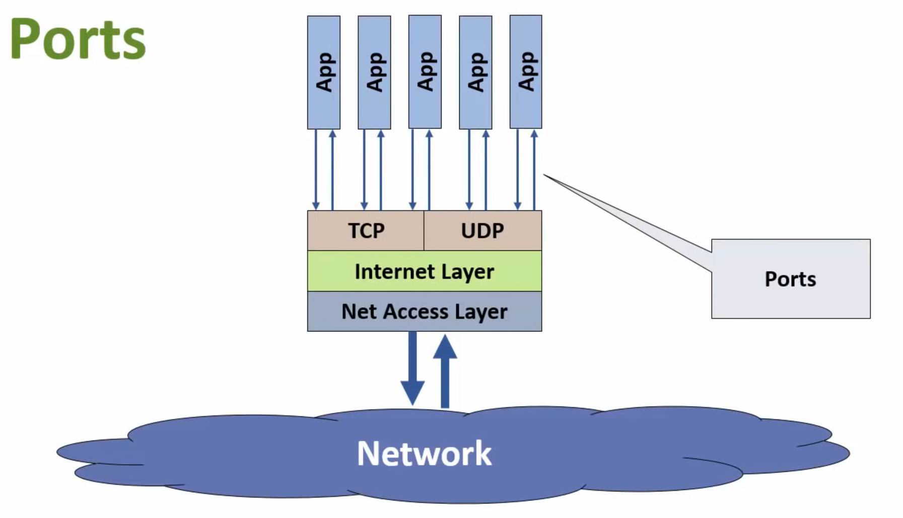

# TCP/IP Networking
Notes taken from https://www.youtube.com/watch?v=b9HafRqtVWc
Video on ^^

## Introduction to TCP/IP
TCP or IP are a family of transfer protocols that make the internet and data transmission possible.
The first step to understand this, is first understanding what a data network is.

**Data Network**: a group of computers or computer-like devices that communicate over a shared connection.

Data & requests for data are transmitted between computers over the network.

A physical connection can be made through copper cables, fiber optics, or radio waves(Wi-Fi).

## Basic Network Functionality

For a network to function, the computers in the network need to be able to do a couple of things.

- The computers need to be able to talk to each other.
- Understand what has been said.
- Confirm they have received the message.

 

## Applications
An **application**: lets a computer interact with other computers by performing a specific set of tasks.
And it is responsible for managing the transmitting and recieving of data required to perform its tasks.

For this application to be useful, the application needs to be able to talk to other applications on the networked computers.

A **network protocol**: is a set of rules the applications follow when comunicating with each other.

## Application Data Flow
Data flows through the sending application, to the networked computers hardware, accross the network, through the receiving networked computers hardware to he recieving application.


## TCP & IP Applications
Some common applications include:

- SMTP, IMAP and POP (Email)
- HTTP & HTTPS (Web)
- SSH (Secure access)
- NFS & FTP (File transfer)

## TCP/IP
The protocols that make up TCP/IP define:

- How data is transmitted accross a network
- How data should be formatted so other networked systems can understand it

TCP/IP provides a complete system for formatting, transmitting and recieveing data on a network.

A TCP/IP implementation is a software package that handles all of the formatting, transmitting and receiving of data.

Process Software's MultiNet and TCPware packages let OpenVMS systems participate in data networks.

## The Internet
TCP/IP is the standard for modern data communications across all networks.

In the 1970s, two kinds of networks were being developed (simplied):
- Local area networks (LANs)
- ARPAnet

Computers networks used to only be run on same brand systems, like how Apple stuff only works with other apple stuff, but waaay worse.
Making networks like the internet impossible.

Also in much larger systems, it makes certain points much more valuable (and crucial) to a working system. 

That's when the US goverment was like "Oh hell Naw" and decided to assign Defense's Advanced Research Projects Agency (ARPA) with the task of a decentralised system.
This would give the network the ability to not be affected by large-scale foriegn attacks.

ARPAnet's protocols provided the basis for TCP/IP systems and subsquently the Internet.

In the 1970s the National Science Foundation wanted to network universities and research institutions.
They built this systems of ARPAnet's design and protocols to create the internet.

## Decentralised Data Networking

- TCP/IP's decentralised nature us a key reason it's still ubiquitous today
- Two key TCP/IP features support decentralisation:
	1) **End node verification**: the two endpoints of any data transfer are responsible for making sure it was successful - no centralised control scheme.
	2) **Dynamic routing**: End nodes can transfer data over multiple paths, and the network chooses the best(fastest, most reliable) path for each individual data transfer.

## Local Area Network
- LAN Technology was being developed in parallel to ARPAnet and the Internet
- Early LANs were highly proprietary and didn't support the concept of a larger network (like the internet)

## 5 Core Networking Problems
1) Addressing
2) Routing
3) Name resolution
4) Flow control
5) Support for external applcations

### Physical Addressing
Every hardware device, that has ever been network-connected, or ever will be network-connected has a unique ID, a MAC address (or Machine Access Code).
This physical ID is "burned" into the device when it's fabricated.
On a LAN, the network uses these MAC addresses to move data across the physical network.

You can think of MAC addresses like phone numbers.
On a very small network, nodes(computers) can just blindly dump data onto the physical network.
Then every node has to examine every transmission and figure out which data is meant for it.

On larger networks the "dump and parse" method's capabilities are quickly exceeded. Like the internet for example, if you were to even try to listen to a millionith of it, would be like trying to drink from a fire hydrant.

Most addressing schemes that work with physical addresses can't scale beyond very small networks.

### Logical Addressing
**Routers**: are special network devices that let you devide large networks into smaller **subnets**.
A well-designed network uses routers to create a tree-like structure.
The hierarchy of routers lets data travel between nodes without hitting every other node on the network.

TCP/IP provides native support for logical addressing.
**IP Address**: logical address configured in a node's TCP/IP implementation
IP addresses can be broken down into network, subnet and host ID numbers:
```192.186.143.227```

### Routing
**Routers** are specialised devices that move data across networks
Routers use the logical address information in a data packet to send it to its destination
Routers isolate a subnet's traffic from the entire network
Data transmitted between systems on the same subnet isn't transmitted across the larger network 


Keeps unnecessary traffic from cluttering up the entire network.
Data traffic destined for a system outside the subnet is transmitted as far up the networkas it needs to go.

Large networks have lots of routers and multiple possible paths between nodes.
TCP/IP specifies how routers should pick the best path across a network.

### Name Resolution
Logical IP addresses are "friendlier" than physical MAC addresses, but still aren't really human readable.

**Domain Names**: structured, user friendly system names provided by TCP/IP.

Examples of domain names:
- www.process.com
- mail.wku.edu
- travel.state.gov


**Name Resolution**: the process of mapping logical addresses back and forth into domain names.

Special **name servers** store the mapping information in databases.
TCP/IP's Domain Name Service (DNS) provides a hierarchy of name servers that handle name resolution for the Internet.

### Error Checking & Flow Control
Several features integrated into TCP/TP guarantee reliable data transfers:
- All data transmissions are checked for corruption and missing data.
- All data transmissions are positively acknowledged by the receiving node.
- In-band flow control so any system involved in a data transmission can control the rate at which data is sent.

### Application Support
Key features of modern networks is ability to run multiple network apps simultaneously.

**Ports**: logical channels provided by TCP/IP that allow multiple applications to access the network simultaneously.

Ports identified by unique numbers.

An easy way to think of ports, would be to think of the logical ports like pipelines, each pipe only allowing a single flow of data transmission.



## Standard Organizations
TCP/IP is based on open and complete standards.
Standards guarantee interoperability of network software and hardware.
Several standards organisations are responsinle for developing and maintaining TCP/IP's standards.


Internet Architecture Board (IAB).
Sets general policies for the Internet.
Manages development of data protocols and standards.


Internet Engineering Task Force (IETF).
R&D organisation that develops Internet standards.
Composed of **working groups** that focus on a particular area.


Internet Corporation for Assigned Names and Numbers (ICANN).
Manages IP addresses, domain names, and port numbers.

**Requests for Comments (RFC)**: standards published by the IETF.

Every part of the TCP/IP and the Internet has its own RFC.
RFCs are the best way to get a complete understanding of a standardm protocol, or practice.
Freely available from [www.ietf.org](https://www.ietf.org)


