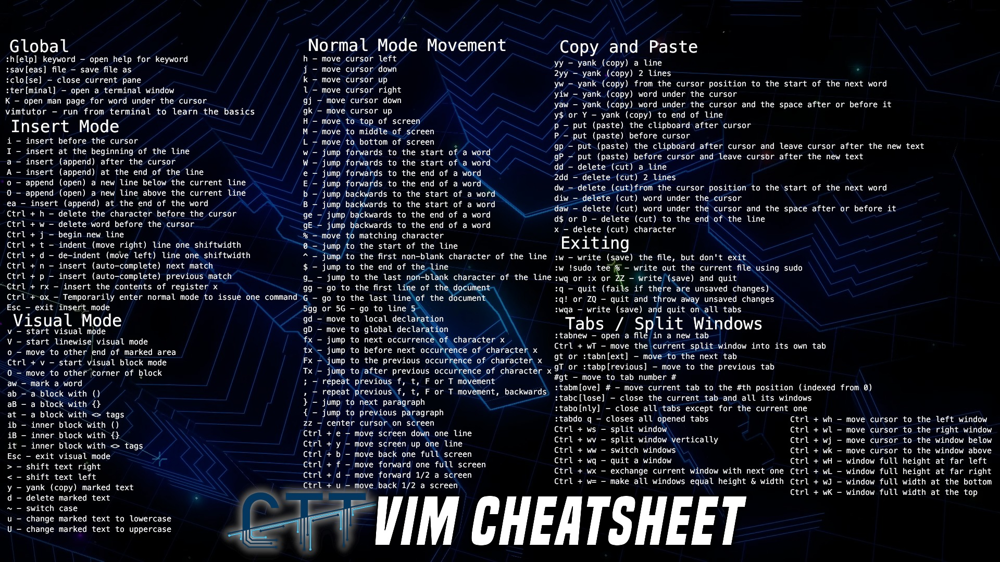

# Useful Linux commands 

[Learning Terminal Part 1](https://www.youtube.com/watch\?v\=XK81cfvrElg\&list\=PLc7fktTRMBozYfi4zlDeH0IdLdGImeOnO)

## Commands

- `cd` - Change Directory
- `more` - Used in conjunction with pipes "|" in commands that have longer results. Enables user to use arrow keys or space bar to scroll. Shift + Z + Z to exit.
- `echo` - Used to enter text in the terminal.
- `sudo` - Some commands need this as verification.
- `su` - Switch User
- `rm` - Remove file, `rm -Rf` to *recursively force* removing folders and its contents
- `mkdir` - Make Directory
- `ls` - List directory
- `mv` - Move/rename file/directory
- `pwd` - Print Working Directory
- `cp` - Copy files/directories
- `nano` - In terminal text editor
- `cat` - Show contents of file
- `chmod` - permissions modifications
- `chown` - change ownership
- `COMMAND --help` - quick access help guide
 
## Commands from [part 2](https://www.youtube.com/watch\?v\=kVlkgiwiY6w\&list\=PLc7fktTRMBozYfi4zlDeH0IdLdGImeOnO\&index\=2)

- `history` - Shows list of commands you've given. You could then use `!`+start of last command+`TAB`, to run a previous command. 
Or even `!`+Line Number. EXAMPLE = `!148` or `!nan`+`TAB` = nano .bashrc
- `grep` - Used in conjunction with any command that spits out a wall of text. 
Usage goes something like `ls -laR / | grep '*.mov'`. 
Probably a bad example, since I could've just done that with the ls command but hey.
- `df` - Disk Free `-h` for Human readable
- `ssh` - A way to securely access another computer. 
Usage `ssh <remote-user>@<destination-IP-or-DNS>`. `exit` to logout the remote computer.
- `ifconfig -a` - Find your internal IP address within your home network.
- `curl ifconfig.me` - This runs a script at https://ifconfig.me that executes a long list of commands that give you your external IP address (the internet facing one)
- `top` - Display the processes running
- `htop` - much more powerful version of `top`


## [Part 3 - How to find files](https://www.youtube.com/watch\?v\=gibm4NYWSqg\&list\=PLc7fktTRMBozYfi4zlDeH0IdLdGImeOnO\&index\=3)
- `find` - The find command can be used to find files.

```bash
find ~/Dropbox/Documents -name "*.label"
```

This would find all files that end with `.label`. **Case sensitive.**

Now lets say you need to find a photo, but you can't remember whether it's called "photo.png" or "Photo.png".

```bash
find ~ -iname "photo.png"
```

Find files in from the last 7 days
```bash 
find <path> -mtime -7
```

Find files from the last 7 minutes
```bash
find <path> -mmin -7
```

Find files from the last 30 days above 10MB in Size
```bash
find <path> -mtime -30 -size +10M
```

- `whereis` - This command helps to find packages.
```bash
whereis zsh;
whereis zip;
```

- Building Programs from source. 
[Watch here](https://www.youtube.com/watch\?v\=atSZAbyrjxU\&list\=PLc7fktTRMBozYfi4zlDeH0IdLdGImeOnO\&index\=7)
## vim
[See video here](https://www.youtube.com/watch\?v\=P88ydZVcm1s\&list\=PLc7fktTRMBozYfi4zlDeH0IdLdGImeOnO\&index\=9)

NGL I thought vim was also just for veterans. After watching that guy jump around so easily.. Pfft, *now I need to learn vim.*

I've set my background to the VIM cheatsheet, to remembering all the shortcuts less of a task.



You can use the command `vimtutor` to help you learn.

## Sidenote
I just found this by accident.

Let's say these are your recent directories in order.
Most recent to last recent. 
```bash
~
~/Dropbox/coding
/
/Users
```
I can use `1`,`2`,`3`, etc to `cd` between my most recent directories.

If my working directory was `~`, I could press `1` + `<ENTER>` to switch to `~/Dropbox/coding`, then `2` + `<ENTER>` to switch to `/`.
